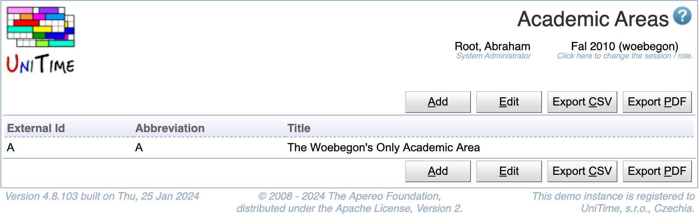

## Screen Description

 The Academic Areas screen provides an overview of academic areas for a given session. It also has an editable version for authorized users (accessible by clicking on the Edit button).

{:class='screenshot'}

## Details

 **Table**

 The table contains an academic area per each line. It can be sorted by any of its columns, just by clicking on the column header and the sorting option that opens.

* External Id
	* External id of the academic area

* Abbreviation
	* Academic area abbreviation

* Title
	* The title of the academic area

* **+** (in the editable version)
	* Add a line for a new academic area

* **×** (in the editable version)
	* Remove the academic area

 In the editable version of the table, each field can be edited by an authorized user.

## Operations

* **Edit**
	* Edit the table of academic areas

* **Save**
	* Save changes made to the table and go back to the overview version of the screen

* **Back**
	* Go back to the overview version of this screen without saving any changes
