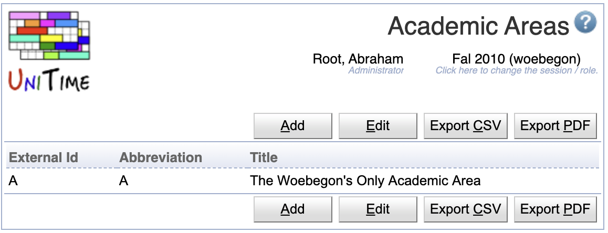

## Screen Description

The Academic Areas screen displays and allows editing of the list of available academic areas for the current academic session.

{:class='screenshot'}

Academic areas are one of the student curricular properties, typically used to express the college, department, or program of study. Student curriculum may contain the following items:
* [Academic Area](academic-areas) (e.g., college or program of study)
* [Academic Classification](academic-classifications) (e.g., year or semester of study)
* [Major](majors) (e.g., specialization)
* [Concentration](concentrations) (optional, e.g., program/specialization variant)
* [Campus](campuses) (optional)
* [Degree](degrees) (optional, e.g., Master, Bachelor or Certification)
* [Program](programs) (optional)

or

* [Academic Area](academic-areas) (e.g., college or program of study)
* [Academic Classification](academic-classifications) (e.g., year or semester of study)
* [Minor](minors)

A student may contain multiple tuples of (academic area, classification, major, concentration, campus, degree, program) and/or (academic area, classification, minor).

## Properties

Each academic area contains the following properties:

* External Id
	* External ID of the academic area
	* External IDs are only editable via the [XML import](https://www.unitime.org/uct_interfaces.php)
	* Academic areas with an external ID cannot be deleted. The presence of the External ID indicates that the academic area has been imported from an external system.

* Abbreviation
	* Academic area abbreviation

* Title
	* The title of the academic area

An academic area may contain one or more majors and/or minors, there are editable on the [Majors](majors) and [Minors](minors) screen.

## Operations

The table can be sorted by any of its columns, just by clicking on the column header and the sorting option that opens.

### Add Academic Area
Click **Add** to add a new academic area

{:class='screenshot'}

* Click **Save** to create a new academic area
* Click **Back** to return to the list without making any changes

### Edit Academic Area
Click a particular academic area to make changes or to delete the academic area

{:class='screenshot'}

* Click **Save** to make changes, **Back** to return to the list without making any changes
* Click **Previous** or **Next** to save the changes and go to the previous or next academic area respectively
* Click **Delete** to delete an academic area. Academic areas with an external ID (i.e., that has been imported from an external system) cannot be deleted.

### Edit Academic Areas
Click **Edit** to edit all academic areas

{:class='screenshot'}

* Use the  icon to add a new line and  to delete a line
* Academic areas with an external ID (i.e., that has been imported from an external system) cannot be deleted
* Click **Save** to make changes, **Back** to return to the list without making any changes

### Export CSV/PDF
Click the **Export CSV** or **Export PDF** to export the list of academic areas to a CSV or PDF document respectively