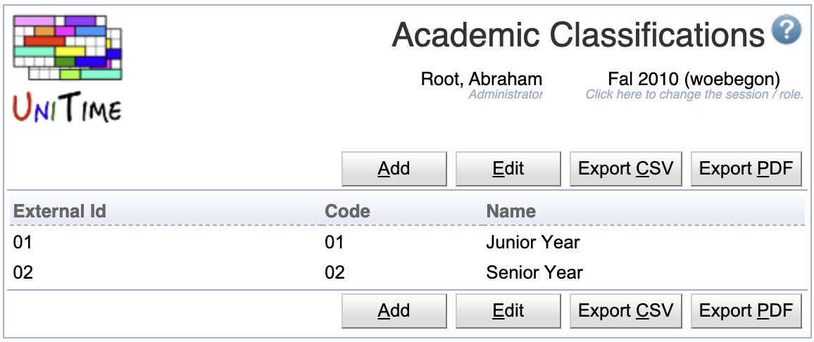

## Screen Description

 The Academic Classifications screen provides an overview of academic classifications. Its editable version (after clicking the Edit button) serves for setting up or editing academic classifications.

## Details

 **Table**

 The table contains an academic classification per line. It can be sorted by any of its columns, just by clicking on the column header and then on the sorting option that opens.

* External Id
	* External id of the academic classification

* Code
	* Abbreviation/Code of the academic classification

* Name
	* Name of the academic classification

* **+** (in the editable version)
	* Add a line for a new academic classification

* **×** (in the editable version)
	* Remove the academic classification

## Operations

* **Edit**
	* Switch to the editable version of the screen to edit the table of academic classifications

* **Save**
	* Save changes made to the academic classifications and go to the overview version of the screen

* **Back**
	* Go back to the overview version of the screen without saving any changes

{:class='screenshot'}
