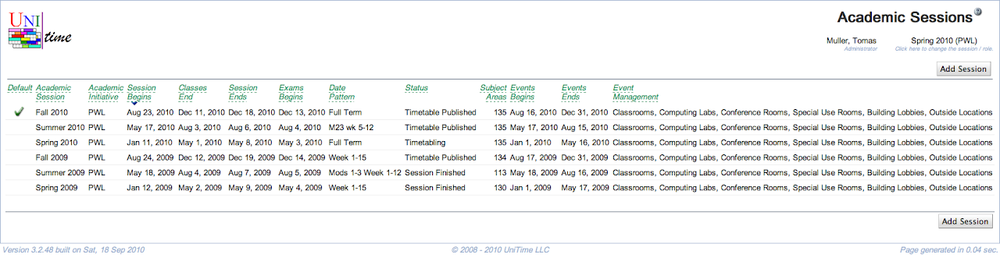

## Screen Description

 The Academic Sessions screen provides a list of existing academic sessions.

## Details

* **Default**
	* Checked if a session is the default academic session
	* It identifies an active session with the nearest dates, if there is only one like that (e.g., all sessions are of the same academic initiative). If there is a default session, it is automatically selected when the user logs into the application, otherwise [Select Academic Session](select-academic-session) or [Select User Role](select-user-role) page is presented.

* **Academic Session**
	* Name of the academic session

* **Academic Initiative**
	* Name of the academic initiative (useful when the institution has multiple program initiatives requiring multiple independent timetables)

* **Session Begins**
	* The date when the session begins

* **Classes End**
	* The date when classes end

* **Session Ends**
	* The date when session ends (for example, a session can end after final exams, a week or two after the classes end)

* **Exams Begin**
	* The date when final examinations begin

* **Date Pattern**
	* The default date pattern for the academic session

* **Status**
	* Current status of the session (such as Initial Data Load, Timetabling, ...)
	* The statuses are defined in the [Status Types](status-types) screen

* **Subject Areas**
	* The number of subject areas in the academic session

* **Events Begin**
	* First date for which events can be entered for this academic session

* **Events End**
	* Last date for which events can be entered for this academic session

* **Event Management**
	* Types of rooms that can be used for event management for that academic session

 Click on any line to change the session's properties in the [Edit Academic Session](edit-academic-session) screen.

## Operations

* **Add Session**
	* Add a new academic session in the [Add Academic Session](add-academic-session) screen

{:class='screenshot'}
