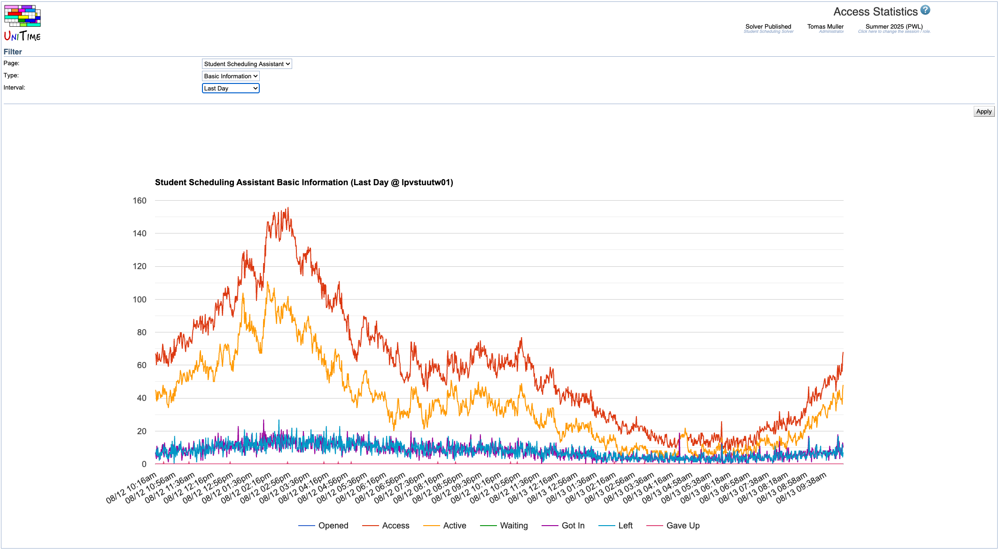
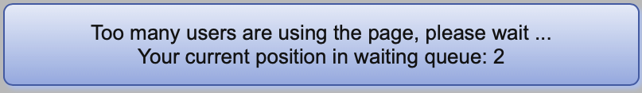
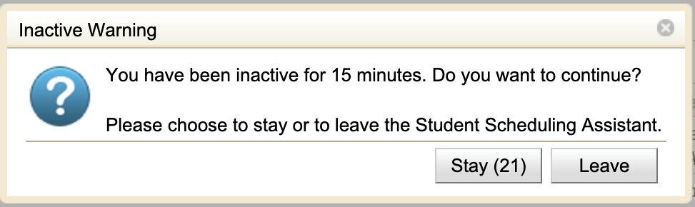

## Screen Description

The Access Statistics shows access statistics for the [Student Scheduling Assistant](student-scheduling-assistant) or [Student Course Requests](student-course-requests) page.

{:class='screenshot'}

If there are multiple web servers, a chart is displayed for each server. This page is useful especially when the [access control](access-statistics#access-control) is enabled for one of the two pages.

The page is only available to admins with the Access Statistics permission.

## Filter

There are the following parameters in the Filter:

* **Page**
    * [Student Scheduling Assistant](student-scheduling-assistant) or [Student Course Requests](student-course-requests) at the moment

* **Type**
    * There are three types of charts:
    * **Basic Information**
        * **Access**: The number of users who had the page open at the time
        * **Active**: The number of active users at that time *-- this number can be limited*
        * **Opened**: The number of users who opened the page 
        * **Left**: The number of users who left the page
        * **Waiting**: The number of users that were waiting in a queue for the page (when the access is limited to a certain number of active users)
        * **Got In**: The number of waiting users who got in
        * **Gave Up**: The number of waiting users who gave up (closed the page without getting in)
    * **Active Users**
        * Users active during the last 1, 2, 5, 10, and 15 minutes
    * **Average Times**
        * **Average Time [m]**: Average time the page is opened in minutes for the students who have the page currently opened.
        * **Wait Time [m]**: Average waiting time for students who are currently waiting for the page to open.
        * **Access when left [m]**: For the students who just left the page, the average time they had the page open in minutes.
        * **Wait when got in [m]**: For the students that just got in, the average waiting time before the page was opened in minutes.

* **Interval**
    * **Last Hour**
    * **Last Three Hours**
    * **Last Day** (24 hours)
    * **Last Week**
    * **Last Month**
    * **Custom** (custom selection of start and end date and time, till now when end date and time are not set)

## Access Control

The access control is available for the [Student Scheduling Assistant](student-scheduling-assistant) and the [Student Course Requests](student-course-requests) pages currently. It limits the number of active users who can use the page at the same time. There are the following properties that can be configured in the [Application Configuration](application-configuration):

### Student Scheduling Assistant
* `unitime.accessControl.sectioning.activeLimitInMinutes`
    * Number of minutes of inactivity for the user to get the Inactive Warning.
    * Defaults to 15 minutes.
* `unitime.accessControl.sectioning.maxActiveUsers`
    * Maximal number of users using the page at the same time (not set or zero for disabled).
    * Not set by default.

### Student Course Requests
* `unitime.accessControl.sectioning.activeLimitInMinutes`
    * Number of minutes of inactivity for the user to get the Inactive Warning.
    * Defaults to 15 minutes.
* `unitime.accessControl.sectioning.maxActiveUsers`
    * Maximal number of users using the page at the same time (not set or zero for disabled).
    * Not set by default.

When the number of active users is reached, all the new users will be queued for the page, seeing the following message before the page is opened:

{:class='screenshot'}{:style='width:50%;'}

When the user is not active (there are no mouse clicks or key presses anywhere on the page), the following message gets displayed when the inactive limit is reached:

{:class='screenshot'}{:style='width:50%;'}

The **Stay** button shows a timer counting down seconds from 60. The page is left when the timer reaches zero without any activity from the student or when the **Leave** button is clicked.

The limits can be adjusted dynamically in the [Application Configuration](application-configuration). When the limit is decreased, existing users are not kicked out, but new users will not be admitted until the number of active users falls below the new limit.
