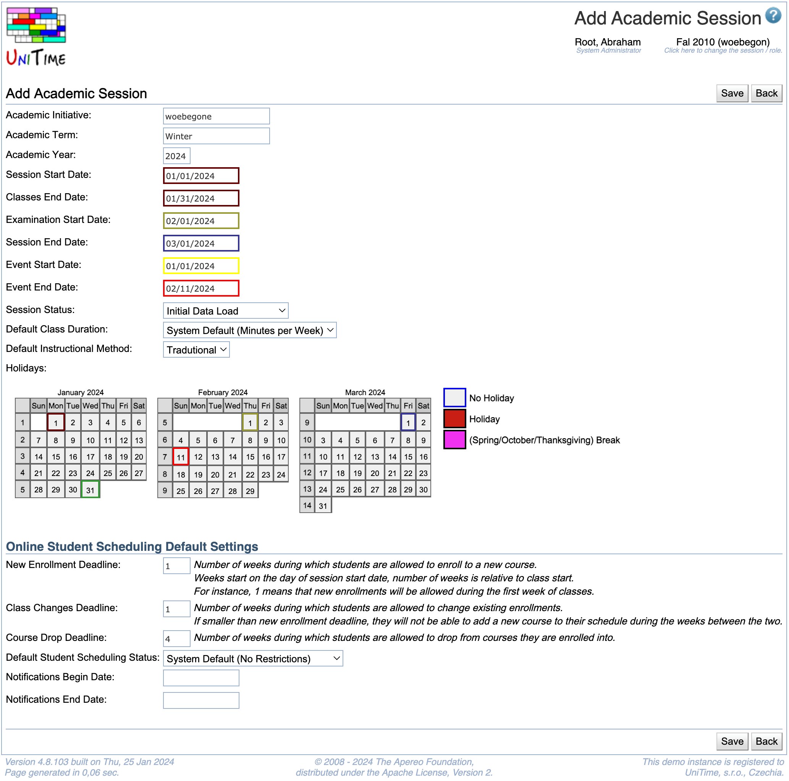

## Screen Description

 In the Add Academic Session screen, you can define a new academic session, including e.g. its start and end date or holidays throughout a term.

{:class='screenshot'}

## Details

* **Academic Initiative**
	* Name of the academic initiative (for example, a campus within a university)

* **Academic Term**
	* Term (semester) of this academic session

* **Academic Year**
	* Year of this academic session

* **Session Start Date**
	* The date when the session begins

* **Classes End Date**
	* The date when classes end

* **Examination Start Date**
	* The first date of final examinations

* **Session End Date**
	* The date when session ends (for example, a session can end after final exams, a week or two after the classes end)

* **Events Start Date**
	* First date for which events can be entered for this academic session

* **Events End Date**
	* Last date for which events can be entered for this academic session

* **Session Status**
	* The session status indicates what users can do within a session
	* The options are set up in the [Status Types](status-types)
	* The current basic statuses are
		* Initial Data Load: Populating data from other resources or from the previous like-term before the schedule managers are allowed to start working in this session
		* Input Data Entry: Schedule managers can edit input data and run the solver, but they cannot commit a timetable
		* Timetabling: The schedule managers can edit data, create and commit timetables
		* Timetabling Published: No schedule manager can edit input data or change timetables

* **Default Class Duration**
	* Set the default class duration type for this academic session
	* _Minutes per Week_ is used by default
		* This is the existing behavior, where the minutes per week equals to the number of meetings times the minutes per meeting.
	* See [Class Duration Types](class-duration-types) for more detail

* **Default Instructional Method**
	* Default instructional method for this academic session
	* Used in the Scheduling Assistant to allow students to put a preference on instructional configurations without an instructional method selected
	* Instructional methods are defined in the [Instructional Methods](instructional-methods) screen
	* This option is not available when no instructional methods are defined

* **Holidays**
	* This part is displayed after the Academic Year and Start and End dates are filled in
	* A calendar appears for a period of time from one month before the start date to one month after the end date of the academic term
	* Indicate holidays and breaks within the academic session by clicking on the colored squares in legend and then on dates in the calendar (classes are not held on these days)

### Online Student Scheduling Default Settings

* **Deadline**
	* Deadlines are related to online student scheduling
	* **New Enrollment Deadline**
		* Deadline for allowing students to enroll in a new course
	* **Class Changes Deadline**
		* Deadline for allowing students to make a change in a course they are already enrolled in (e.g. move to a different section)
	* **Course Drop Deadline**
		* Deadline for allowing students to drop a course

* **Default Student Scheduling Status**
	* Default student scheduling status (no restrictions set by default)
	* Student scheduling statuses are defined in the [Student Scheduling Status Types](student-scheduling-status-types) screen

* **Email Notifications**
	* Optional stard and/or end dates for student schedule change email notifications sent to instructors and students

## Operations

* **Save**
	* Save the new academic session and go back to the [Academic Sessions](academic-sessions) screen

* **Back**
	* Go back to the [Academic Sessions](academic-sessions) screen without saving the new session

