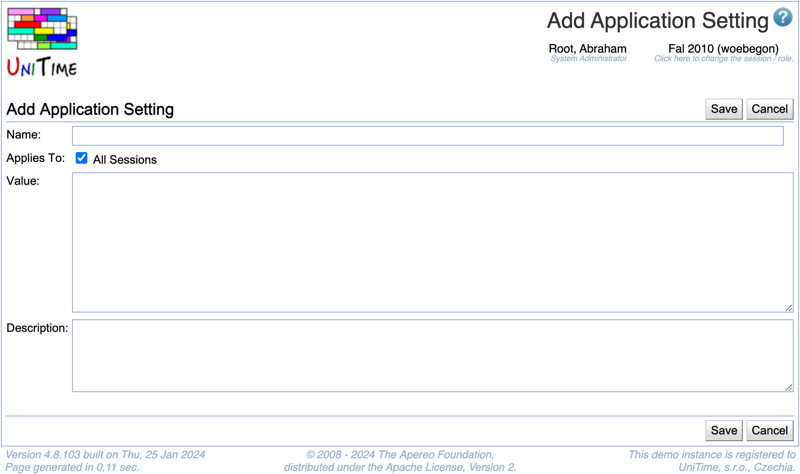

## Screen Description

 The Add Application Setting screen provides interface for adding a new application setting.

 Note: The setting should be first implemented and recognized by the application before it is added here.

{:class='screenshot'}

## Details

* **Name**
	* Name of the setting recognized by the application

* **Value**
	* Current value of the setting

* **Description**
	* Description of the setting; can include possible values of the setting

## Operations

* **Save** (ALT+S)
	* Save the new application setting and go back to the [Application Configuration](application-configuration) screen

* **Back** (ALT+B)
	* Go back to the [Application Configuration](application-configuration) screen without saving the new setting
