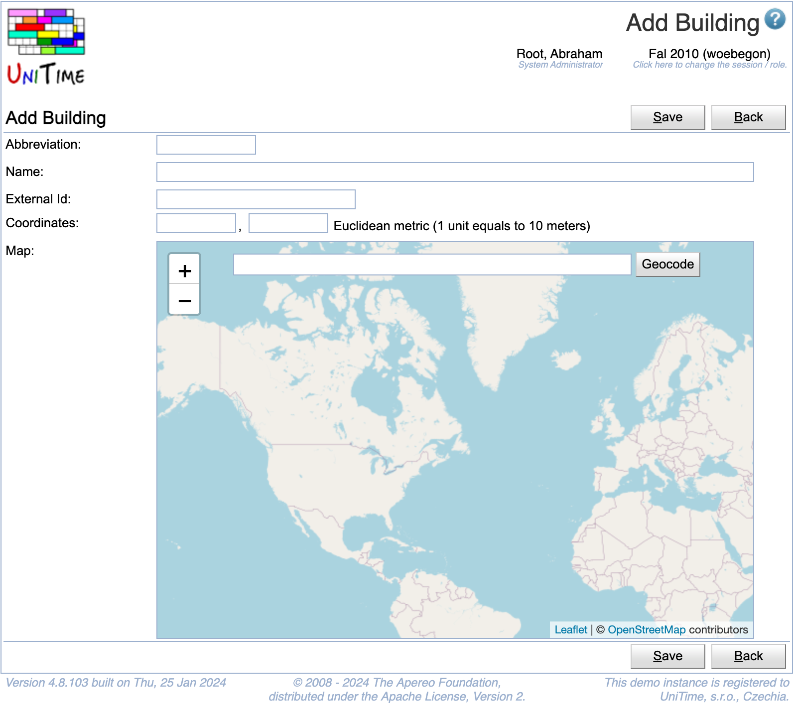

## Screen Description

The Add Building screen provides interface for adding a new building.

{:class='screenshot'}

## Details

* **Name**
	* Name of the building

* **Abbreviation**
	* Building abbreviation

* **External ID**
	* External ID of the building (optional)

* **Coordinates**
	* X and Y coordinates of the building (used in calculating distances between buildings)
		* Distance between two buildings is computed as [Euclidean distance](http://en.wikipedia.org/wiki/Euclidean_distance) between coordinates × 10 meters (e.g., distance between coordinates [0,0] and [3,4] is 50 meters)
		* Coordinates cannot be negative
		* A building with no coordinates is assumed to be too far from any other building (for instructor and student back-to-back constraints)

* **Map**
	* Alternative way of inputing coordinates. Input locations either by clicking on the map or by typing in an address
Note: If you do not have coordinate system established, entering the same coordinates (e.g., [0,0]) for all buildings will ensure that there will be no "too far" instructor and student back-to-back constraint violations in the problem.

## Operations

* **Save** (Alt+S)
	* Save a new building and go back to the [Buildings](buildings) screen

* **Back** (Alt+B)
	* Go back to the [Buildings](buildings) screen without saving anything

