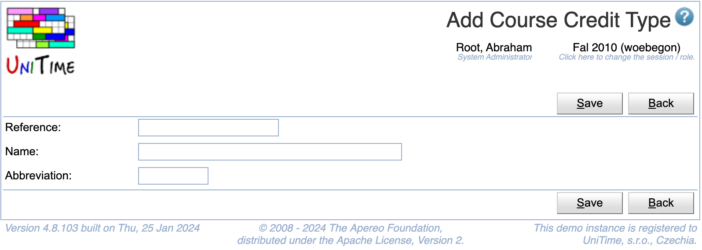

## Screen Description

The Add Course Credit Type page can be used to create a new credit type. See [Course Credit](course-credit) description for more details.

{:class='screenshot'}

## Details

Each course credit type has a reference, a name, and an abbreviation. References and names must be unique.

## Operations

Click **Save** to create the new course credit type. The button **Back** will get you back to [Course Credit Types](course-credit-types) page without creating any new types.

