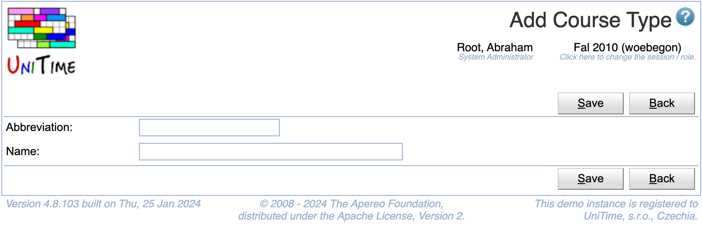

## Screen Description

 The Add Course Type can be used to create a new course type. Course types can be used to categorize course offerings. The user needs to have Course Type Edit permission to be able to edit course types. See [Course Types](course-types) for more details.

{:class='screenshot'}

## Details

 A course type has an abbreviation and a name defined. Both abbreviations and names have to be unique.

## Operations

 Click **Save** to create the new course type. The button **Back** will get you back to [Course Types](course-types) page without creating any new course types.

