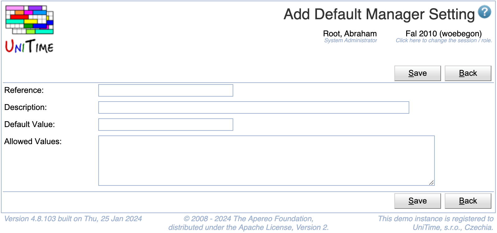

## Screen Description

The Add Default Manager Setting screen provides interface for adding a new manager setting and setting its default value.

_Note: A manager setting should be implemented and recognized by the application before it is added here._

{:class='screenshot'}

## Details

* **Reference**
	* The name by which the application recognizes the setting

* **Description**
	* The description that is displayed in the [Manager Settings](manager-settings) screen (accessible by all schedule managers)

* **Default Value**
	* Value applicable to all schedule managers unless it is changed by them in the [Manager Settings](manager-settings) screen

* **Allowed Values**
	* List of possible values of the setting from which the schedule managers can choose in the [Edit Manager Setting](edit-manager-setting) screen

## Operations

* **Save** (ALT+S)
	* Save the new setting and go back to the [Default Manager Settings](default-manager-settings) screen

* **Back** (ALT+B)
	* Go back to the [Default Manager Settings](default-manager-settings) screen without saving the new setting

