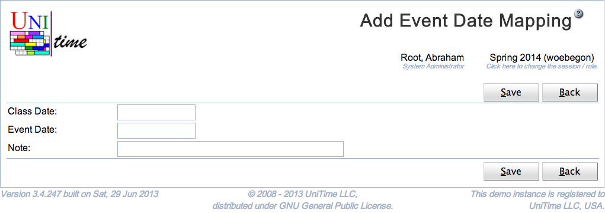

## Screen Description

The Add Event Date Mapping page can be used to create a new event date mapping. Event date mappings are used to map class dates to event dates whenever there is a need to follow a different day schedule on a particular day. See [Event Date Mappings](event-date-mappings) for more details.

The user needs to have Event Date Mapping Edit permission to be able to create a new event date mapping. Also, there cannot be any course timetabling solution committed at that time.

{:class='screenshot'}

## Details

An event date mapping has a class date, an event date and a note. If multiple mappings are defined, both class and event dates need to be unique (there cannot be two event date mappings with the same class date or the same event date). Both dates need to be within the given academic session and the class date should be different from the event date. The note is optional.

## Operations

Click **Save** to create the new event date mapping. The button **Back** will get you back to [Event Date Mappings](event-date-mappings) page without creating any new mapping.

