## Screen Description

The Add Event screen is used to request an event. An event can have just one meeting, or there can be multiple meetings that are on the same or on different days, times, and/or locations. Each meeting can be also approved, cancelled, or rejected separately and it is possible to add additional meetings or cancel / delete some or all of the existing meetings later on as well (using the [Edit Event](edit-event) page). The only limitation is that all the meetings must be from the same academic session.

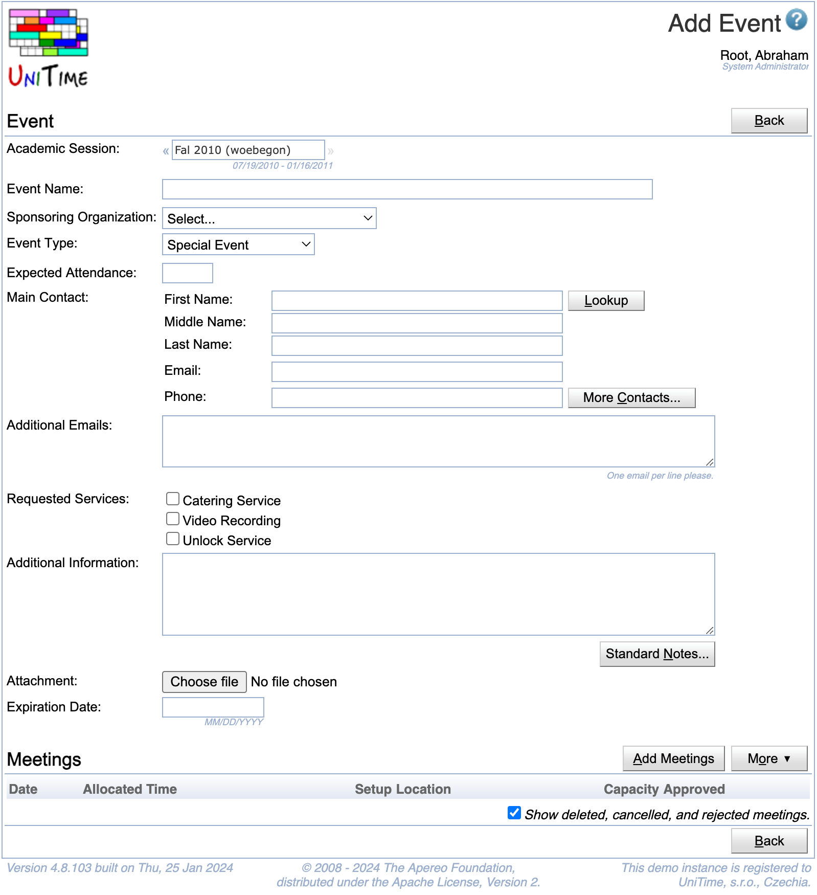{:class='screenshot'}

Each meeting of a requested event is in a _pending state_ (i.e., it is waiting to be approved) until the appropriate event manager approves, cancels or rejects the meeting. During this time, the owner of the event can delete or cancel the meeting. Once an event is approved, it may only get cancelled. Meetings that are deleted will disappear from the event, but cancelled or rejected meetings will leave a trace (e.g., you can see the cancelled or rejected meetings on the [Event Detail](event-detail) page). If all meetings of an event are deleted, the event is deleted as well. Each operation done to an event is also logged in the Event Notes section of the Event (see [Event Detail](event-detail) page).

Each event must have a name and a main contact (with an email). There also needs to be at least one meeting of the event. Besides of a name, an event can have specified a sponsoring organization. If a sponsoring organization is provided, an email confirmation will be sent to the email defined with the sponsoring organization as well. While this field is optional, event requests that are backed up with a sponsoring organization may get approved more easily. Expected attendance is also optional, but it may help justify the size of the requested room or rooms.

Events can be of several types. Most events requested in the event management are **Special Event** type events. These events do not hold any relation to other classes, examinations, or events; they just block a time (or times) in a particular room (or rooms).  Besides of Special Events, there are also **Course Related Events** that can be linked with one or more classes and/or courses.  This allows to see potential student conflicts on the event, and the event (when approved) will also show on student's personal schedules. A course related event may also require all students to attend the event, which means that the event would show for the affected students when there is a conflict with another course related event or in the examination timetabling. Usually, only event managers, schedule deputies, and course coordinators are able to request course related events though. Course related events are therefore quite useful for various (individually scheduled) help sessions and similar class / course related activity. Finally, event managers can also request **Not Available** type of an event. Such events can be used to mark unavailable times in the rooms. There is no approval process for these unavailability events and these events show as grayed out are on the timetable grid.

{:class='screenshot'}

Besides the three types above, there are also **Class Events** and **Examination Events**. These events cannot be created directly in the event management and they are linked with the appropriate class or examination from the course and examination timetabling part of UniTime.

It should be also noted that while even pending meetings block a room from other events to be created, in course and examination timetabling, only approved event meetings are considered. So, it is possible to let people request events in classrooms while a course timetable is still being developed. Once the course timetabling is finished and a timetable is committed, these requests (pending special events) can be processed: not-overlapping events can be approved, overlapping (conflicting) events will need to be moved or rejected.

Only event managers and administrators can request an event on behalf of some other users. In such a case, the "Lookup" button appears and can be used to find a particular user (see the People Lookup dialog on the right side). Event managers and administrators can also lookup additional contacts. Other users can only add additional email addresses, which will be carbon copied on all the confirmation emails about the event.

Additional information may be provided. Event managers and administrators can use one or more standard notes. To do so, click on the "Standard Notes" button, find and double click the appropriate standard note.

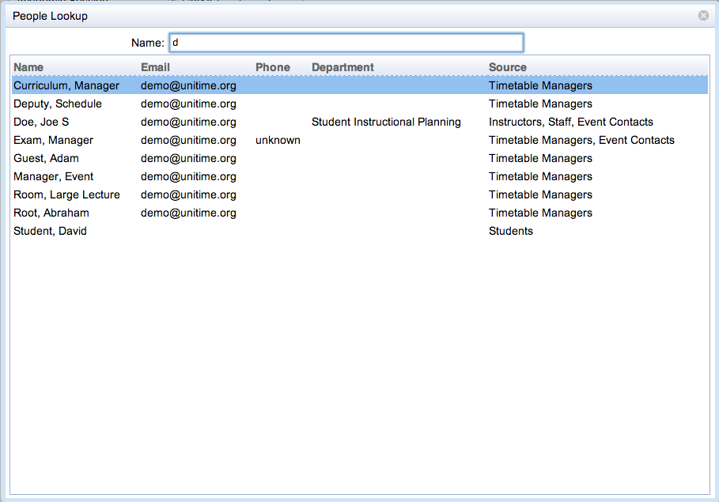{:class='screenshot'}

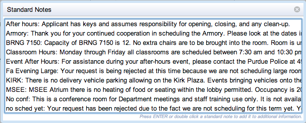{:class='screenshot'}

A file can be attached to an event request as well. This can be used to provide a filled in form or some approval if needed. The need to provide such a file can be listed as a note on a particular room. Such note will show up below the requested meeting in the Meetings table.

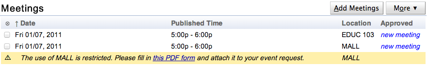{:class='screenshot'}

If allowed (permission Event Set Expiration), an event can have an expiration date. If set, all pending meetings will get automatically cancelled at midnight after the expiration date. This could give event managers the ability to tentatively book a room for a particular event. All the meetings that are not approved by the event expiration date are automatically cancelled. It is also possible to change or remove the expiration date later on using the [Edit Event](edit-event) page.

Event managers have the option to choose whether a confirmation email will be send or not by checking the Send email confirmation checkbox. The checkbox only applies to the particular operation (i.e., the creation of a new event in this case), not to the event as a whole. For the next operation (e.g., using [Edit Event](edit-event) page, or approving the event from the [Event Detail](event-detail) or the [Events](events) page), the _Send email confirmation_ checkbox will be also available. For normal users, an email confirmation is always sent (unless it is disabled globally for everyone by having the application property `unitime.email.confirm.event` set to `false`).

## Meetings

If there was a selection made on the [Events](events) or [Event Room Availability](event-room-availability) page before the Add Event button was clicked, the selection should automatically show up in the list of Meetings. Additional meetings can be also requested using the **Add Meetings** button. If a meeting is conflicting with another meeting, the conflicting meeting will show up in red below the requested meeting. Such meeting will need to be removed from the request or moved to some other time and/or room as usually only event managers and administrators are allowed to overbook a room (i.e., request a meeting that is conflicting with another, already existing meeting).

One or more meetings can be added for the event by clicking the **Add Meetings** button. When clicked, the following dialog will appear. The meeting selection works in two steps: first, the user needs to select possible dates, start and end time for the event, and a [room filter](events-room-filter) for the possible rooms where the meeting (or meetings) can take place. Next, the availability matrix will be shown and the individual meetings can be selected from the combination of selected dates x rooms. Only event managers and administrators are able to select meetings that are in a conflict with some other meeting (i.e., there is a red text in the appropriate box).

{:class='screenshot'}

The first page consists of selection of dates, times, and locations. You can select **dates** by clicking on them. You can click on a particular day, on a week, on a day of week, or on a whole month. Second click will unselect the selected day. When clicking on a week, a day of week, or a whole month, the selection will iterate between all working days since today, all working days, all days except holiday, all days, and no days. It is usually not possible to request a meeting on days before today (though there is a permission that can override that). It is also possible to use arrow keys to navigate through the calendar and space key to select / unselect a particular day. It is possible to select only dates from the academic session that was selected on the Add Event page. **Times** define starting and end time of the requested meeting(s). It is possible to use a mouse to select particular times, or the times can be entered by keyboard. While the suggestions are only in 15 minute increments, it is possible to type in a time with 5 minute increments. The "From:" and "To:" time text fields recognize time in various formats (e.g., 7:00 pm can be entered as 7p, 19, 700pm, etc.), the "To:" time can be also entered in the number of minutes or hours from the start time (e.g., 1h for 1 hour, 90m for 90 minutes). The **Locations** component is explained here: [Events Room Filter](events-room-filter) (the possible locations are filtered by the same Room Filter as on the [Events](events) page). It is useful to keep the _Only events locations_ chip (together with some additional restrictions) in the filter as these are the rooms in which an event can be requested. Once the **Next** button is pressed, the following page will appear.

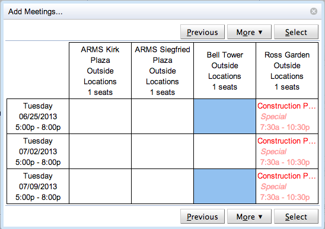{:class='screenshot'}

Here, the availability of the requested rooms during the requested dates and time is shown, and it is possible to select the actual meetings. The selected meetings are the blue boxes. A selection can be made using a mouse or a keyboard (use arrows to navigate, enter to select a meeting). A selection is confirmed by clicking on the **Select** button. The boxes with red text are conflicting, you can see more information about the conflicts while hovering over the appropriate box. More information about a room can be seen while hovering over the room (first line in the example above).

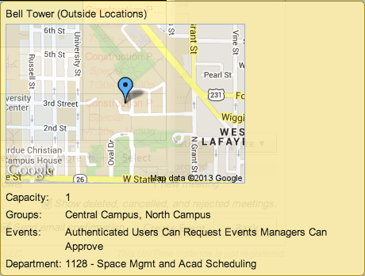{:class='screenshot'}

{:class='screenshot'}

It is also possible to get back to the previous page by clicking the **Previous** button. If there are more rooms available, the **«** and **»** buttons will appear to iterate through all of them. The rooms can be also sorted by name, capacity, or availability. The axes can be swapped (showing days horizontally and rooms vertically) and the conflicting information can be expanded to show more details in the grid. These operations are available when clicking the **More** button.

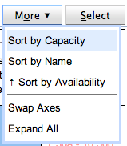{:class='screenshot'}

Once the selection is made, the new meetings will appear in the Meetings table on the Add Event page. It is possible to use the Add Meetings... dialog multiple times, e.g., to be able to request meetings with different times on one event. The requested meetings can be removed from the list by selecting them (click on the check box at the beginning of each line) and clicking **Remove** under the **More** button.

The Meetings table can be sorted by each of the columns (click on the column header to change the way the table is sorted), some columns may be removed from the table (click on the column header of the first column, or on the **More** button).

Event managers may choose whether the meetings in their rooms will be automatically approved or not. The meetings will get automatically approved when _Approve New Meetings_ option is toggled under the **More** button. The last setting of the toggle is remembered. Note that the toggle is only available if there is at least one new meeting that can be immediately approved. Note that if a new meeting is going to be approved right away, there is _new approval_ instead of _new meeting_ in the Approval column.

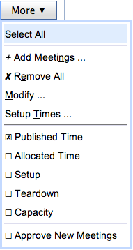{:class='screenshot'}

If a room (or all rooms of a particular type and department, e.g., all centrally managed classrooms) has a break time defined (see [Event Statuses](event-statuses) page), the break time translates into a teardown time of a newly requested meeting (in the appropriate room). This means that, for instance, if a 8 am - 9 am meeting is requested in a room that requires 10 minute break time, the allocated time will be 8:00 am - 9:00 am, but the published time will be 8:00 am - 8:50am. This is particularly useful for classrooms as all classes usually have a break time defined (see [Time Patterns](time-patterns)) and it can be a good practice to extend this policy (e.g., there are always at least 10 minutes between two consecutive classes) to other events as well.

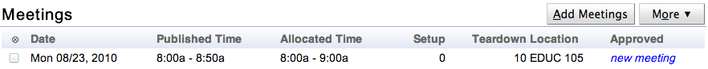{:class='screenshot'}

To change setup / teardown times, select a meeting (or meetings) and use the _Setup Times_... option under the **More** button. The following dialog will appear where the setup times and break times can be changed.

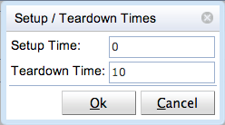{:class='screenshot'}

## Course Related Event

When a new course related event is being created, a Courses / Classes section will appear. Here one or more classes, course configurations, course offerings, or instructional offerings can be entered.

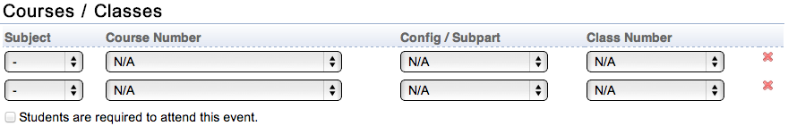{:class='screenshot'}

When a class is entered, students of the class are expected to attend the course related event etc. The difference between course offerings and instructional offerings is important when a couse is cross-listed. In this case, an instructional offering means students from all courses that are cross-listed, a course offering means students only of the selected course offering. The _Students are required to attend this event_ toggle is important when the course related event (once approved) should show as a conflict with other events of the same students. Such an event (approved course-related event which requires students to attend the event) will also show as a conflict in examination timetabling if there is an exam placed in an overlapping examination period and there are some students in common.

Once there is at least one class, configuration, or offering selected in the list of Courses / Classes, the Enrollments section will appear at the bottom of the page. Here, all students that are attending the selected classes / courses are listed. If some of the students have a conflict with one or more meetings that are added on the new event, the conflict part of the table will appear as well listing all the conflicting events (including their names, types, and conflicting meeting or meetings).

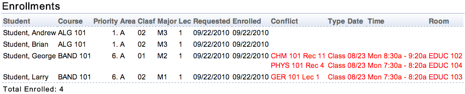{:class='screenshot'}

Note that unless the new course-related event is approved and requires student attendance, the student conflicts will only show on the new course-related event. When the event requires student attendance and it is approved, the conflict with the new course-related event will show on the other event as well.

## Not-Available Event

The not available event does not need to have a name (it defaults to Not Available) and a main contact (it defaults to the person requesting the event). The only required information is the list of meetings during which the appropriate rooms are not available to other events.
