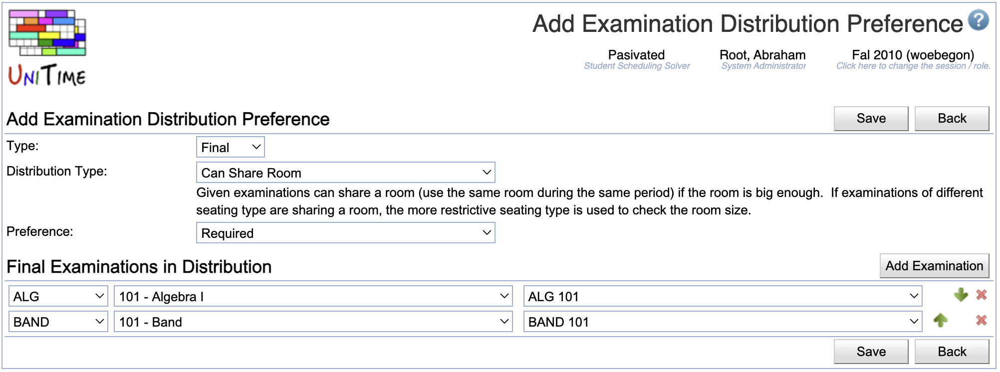

## Screen Description

The Add Examination Distribution Preference screen provides user interface for adding a new distribution preference between midterm or final examinations. The type of the examination depends on the type selected in the screen from which the user got here - either in the [Examination Distribution Preferences](examination-distribution-preferences) screen or in the [Examination Detail](examination-detail) screen.

{:class='screenshot'}

## Details

### Add Examination Distribution Preference

* **Distribution Type**
	* Type of the distribution preference
	* When a type is selected, its description is displayed right below the drop down list
	* Possible types
		* _Precedence_
			* Exams are to be placed in the given order.
			* When prohibited or (strongly) discouraged: exams are to be placed in the order reverse to the given one.
		* _Same Period_
			* Exams are to be placed at the same period.
			* When prohibited or (strongly) discouraged: exams are to be placed at different periods.
		* _Same Room_
			* Exams are to be placed at the same room(s).
			* When prohibited or (strongly) discouraged: exams are to be placed at different rooms.

* **Preference**
	* Preference level - a scale ranging from prohibited to required

### Midterm/Final Examinations in Distribution

* Operation: **Add Examination**
	* Add another line with drop down lists in which you can select another examination

* The three drop down lists on each line are for
	1. Subject area
	2. Course number
	3. Examination name

* Click **Delete** to delete a line with a given examination

## Operations

* **Save** (ALT+S)
	* Save the new distribution preference and go back to the previous sceen

* **Back** (ALT+B)
	* Go back to the previous screen without saving the new preference

