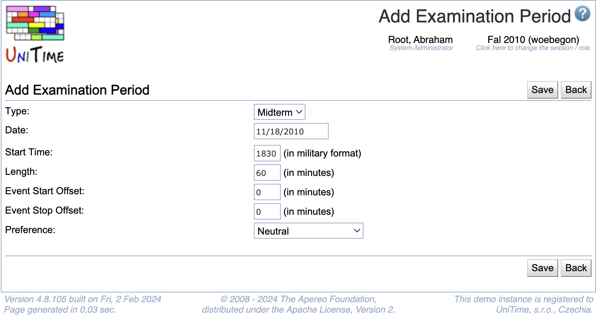

## Screen Description

 The Add Examination Period screen provides interface for adding new examination periods. Note: the regular midterm examination periods can be set-up in the [Midterm Examination Periods](setup-examination-periods) screen, where it is easy to set up days and times for several weeks/months together.

{:class='screenshot'}

## Details

 To add an examination period, it is necessary to fill in the following fields

* **Type**
	* Type of the examination (Midterm, Final)

* **Date**
	* Examination date

* **Start Time**
	* Time when the examination should start

* **Length**
	* Duration of the examination (minutes)

* **Event Start Offset**
	* For how many minutes before the examination should the room be available for students to enter and sit down, or to prepare the room (re-arrange chairs etc.)

* **Event Stop Offset**
	* How many minutes after the examination should the room be available for the students to leave the room or to return the room to the state where it was before the examination

* **Preference**
	* Is it preferable in general to use this examination period? For example, some schools may discourage examinations on Saturdays (there are still examination periods on Saturday, but if possible, examinations are timetabled on other days)

## Operations

* **Save**
	* Save the new examination period and go back to the [Examination Periods](examination-periods) screen

* **Back**
	* Go back to the [Examination Periods](examination-periods) screen without saving the new examination period

