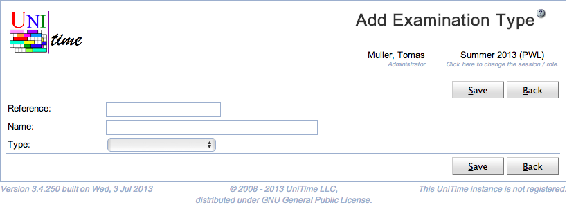

## Screen Description

 The Add Examination Type page can be used to define a new examination type. Examination types can be used to define multiple examination problems in an academic session. For instance, there can be multiple final examination problems defined, each timetabled separately. See [Examination Types](examination-types) page for more details. Permission Examination Type Edit is needed to make changes to examination types.

## Details

 Examination type has an abbreviation and a name. Both abbreviations and names must be provided and unique. An examination type also needs to be either of Final or of Midterm type. This type drives how the examination period preferences are displayed, whether there will be midterm or final examination events created, and they are used in the status types.

## Operations

 Click **Save** to create the new examination type. The button **Back** will get you back to [Examination Types](examination-types) page without creating any new examination types.

{:class='screenshot'}
