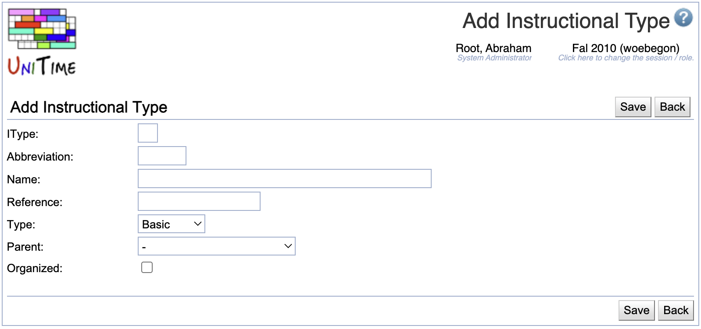

## Screen Description

 The Add Instructional Types screen provides interface for adding a new instructional type for the current academic session.

{:class='screenshot'}

## Details

* **Instructional Type** (IType)
	* ID of the itype (number)

* **Abbreviation**
	* Abbreviation of the name of the itype, used in majority of the input data and solver screens as a part of the class name

* **Name**
	* Name of the instructional type

* **Reference**
	* Reference name of the itype used for external systems

* **Type**
	* Basic - these itypes are always a part of the drop down list in the [Instructional Offering Configuration](instructional-offering-configuration) screen
	* Extended - these itypes are displayed in the [Instructional Offering Configuration](instructional-offering-configuration) screen only when the user clicks on "More Options >>>" in the drop down list

## Operations

* **Save**
	* Save the new instructional type and go back to the [Instructional Types](instructional-types) screen

* **Back**
	* Go back to the [Instructional Types](instructional-types) screen without saving the new instructional type
