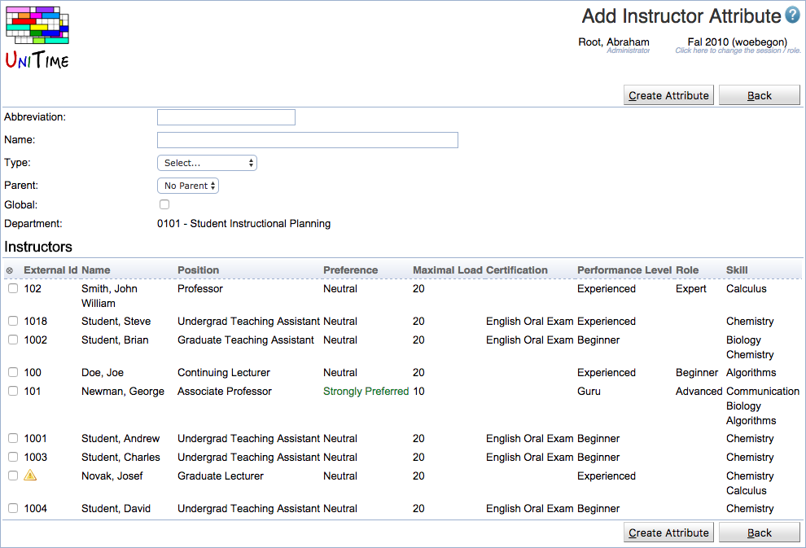

## Screen Description

 The Add Instructor Attribute page can be used to create a new instructor attributes and to assign it to instructors of the selected department. An instructor attribute can be either global (for all departments of the academic session) or departmental (only related to a particular department).

{:class='screenshot'}

 Instructor attribute types need to be defined first, see Administration > Other > [Instructor Attribute Types](instructor-attribute-types) for more details. Permission Instructor Attribute Add is needed to create a new instructor attribute.

## Details

 Each attribute has an abbreviation, name, type (see [Instructor Attribute Types](instructor-attribute-types)), and it can be associated with a list of instructors. An instructor can have multiple attributes of the same type. It is also possible to define a parent of an attribute. This is useful if there is a hierarchy, e.g., an experienced instructor can teach advanced courses, but he/she can also teach beginner classes. In other words, if a particular attribute is preferred or required, instructors with the same attribute or with one of the parent attributes (attribute parent of the selected attribute, or the parent of the parent attribute, etc.) meet the preference or requirements.

## Operations

 Click **Create Attribute** button to create a new attribute. Click **Back** to go back to [Instructor Attributes](instructor-attributes) page without making any changes.
