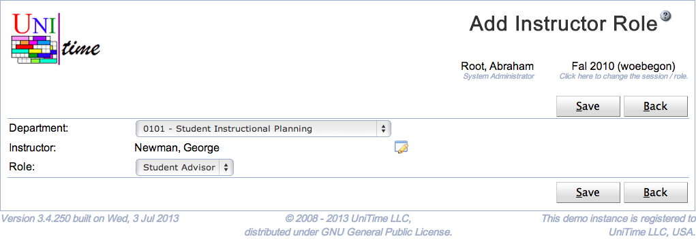
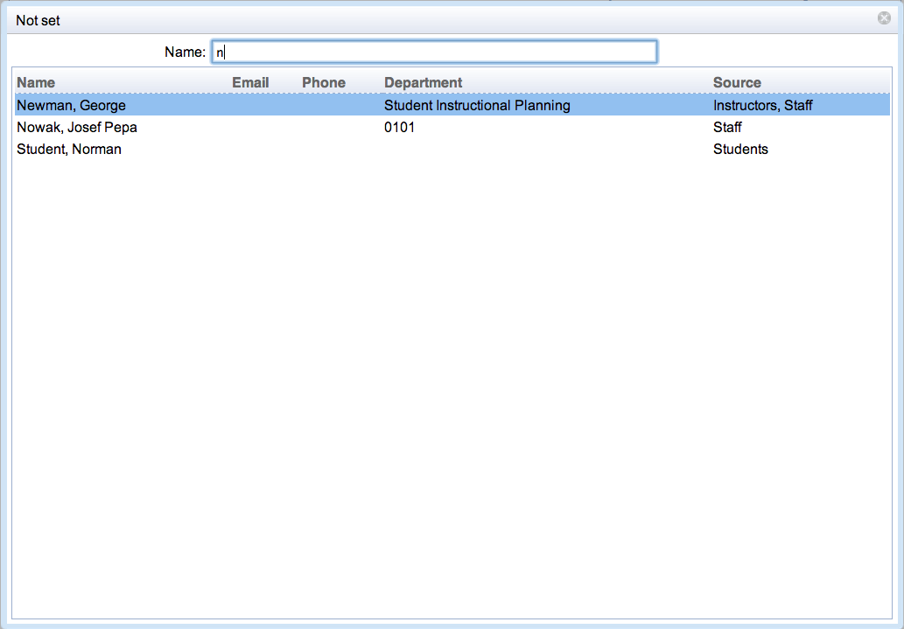

## Screen Description
The Add Instructor Role page can be used to assign a role to an instructor. The user needs to have Instructor Role Edit permission to be able to set instructor roles. See [Instructor Roles](instructor-roles) page for more details.

{:class='screenshot'}

## Details

If the page is used by a user with a departmental role (e.g., an event manager or a schedule manager), only departments that are associated with the user will appear.

A person can be looked up using the little dialog icon on the Instructor line. When clicked, following dialog will appear:

{:class='screenshot small'}

Type in a name (or a part of a name) of a person. The list of matching people will appear. Select one person by clicking on the appropriate line or using keyboard Up and Down arrows and Enter to confirm the selection.

Only roles with the Instructor toggle checked are listed in the Role drop down. See [Roles](http://help34.unitime.org/Roles) for more details.

If the instructor already exists in the department, it will have the role assigned. An instructor record will be created for a new person.

## Operations

Click **Save** to assign an instructor with a role. The button **Back** will get you back to [Instructor Roles](instructor-roles) page without making any changes.
