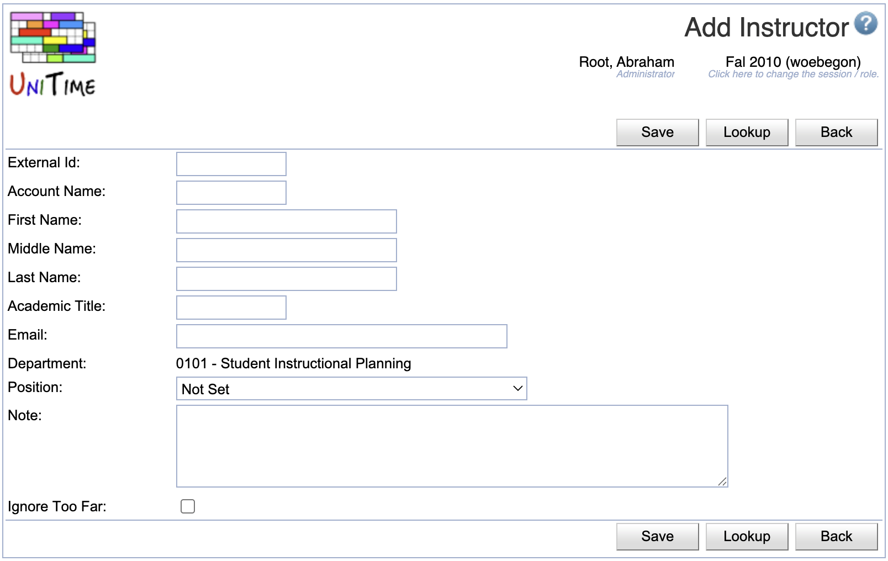

## Screen Description

 In the Add Instructor screen, you can add an instructor to your list of instructors.

## Details

 See the description of the [Edit Instructor](edit-instructor) screen for detailed explanation of the fields.

## Operations

* **Save** (Alt+S)
	* Save information about this instructor and go back to the [Instructors](instructors) screen

* **Lookup** (Alt+L)
	* Look up this instructor's External Id (and other related information) in the imported staff tables
		* Takes you to the screen with the same name (Edit Instructor) which has the search results in it
			* First, you will see a list of matches by the university account (if you filled in the account name)
			* The second part are matches by last name regardless of department (if the instructor teaches for more than one department, you can see the same name with the same External Id displayed several times)
			* Click on the radio button in front of the correct person and click **Select Instructor** if you found the right match (that will populate the External Id of this instructor)
			* Click **Cancel** if you want to return to the previous screen without selecting anybody
		* Message "No matching records found" will appear in the Edit Instructor screen if there is no record matching the instructor's name or the account name that you entered

* **Back** (Alt+B)
	* Go back to the previous screen without saving any information

{:class='screenshot'}
