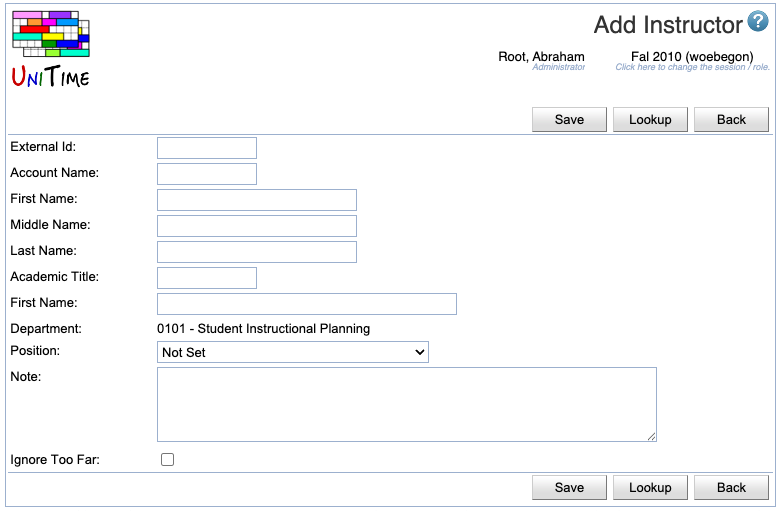

## Screen Description
In the Add Instructor screen, you can add an instructor to your list of instructors.

{:class='screenshot'}

## Details

* **External Id**
	* Id that identifies this instructor throughout UniTime
	* If possible, matches the university's employee Id

* **Account Name**
	* If you know the university account name of a new instructor, you can look the person up by this account
	* **Note:** This field is user maintained and is not required elsewhere in UniTime

* **First Name**
	* First name of the instructor
	
* **Middle Name**
	* Middle name of the instructor

* **Last Name**
	* Last name of the instructor
	* The only mandatory field in this screen

* **Last Name**
	* Academic title of the instructor (optional)

* **Email**
	* Instructor's email address

* **Department**
	* Shows the department selected in the [Instructors](instructors) screen

* **Position**
	* Position classification of this instructor
	* **Note:** This field is user maintained and is not required elsewhere in UniTime; it may be useful, however, for grouping instructors or in exports for departmental report

* **Notes**
	* For your use only

* **Ignore Too Far**
	* By default (when unchecked), the solver prohibits placement of back to back classes taught by the same instructor in rooms that are more than a short distance apart
	* If checked, the solver will strongly discourage but not prohibit long distances between back to back classes of this instructor
		* Use with caution!
		* When your timetable is created, make sure you check whether the instructor for whom you chose to ignore too far distances has a feasible timetable (that the instructor can in fact teach the classes that are back to back)

## Operations

* **Save** (Alt+S)
	* Save information about this instructor and go back to the [Instructors](instructors) screen

* **Lookup** (Alt+L)
	* Look up this instructor's External Id (and other related information) using the [People Lookup](people-lookup) dialog

* **Back** (Alt+B)
	* Go back to the previous screen without saving any information
