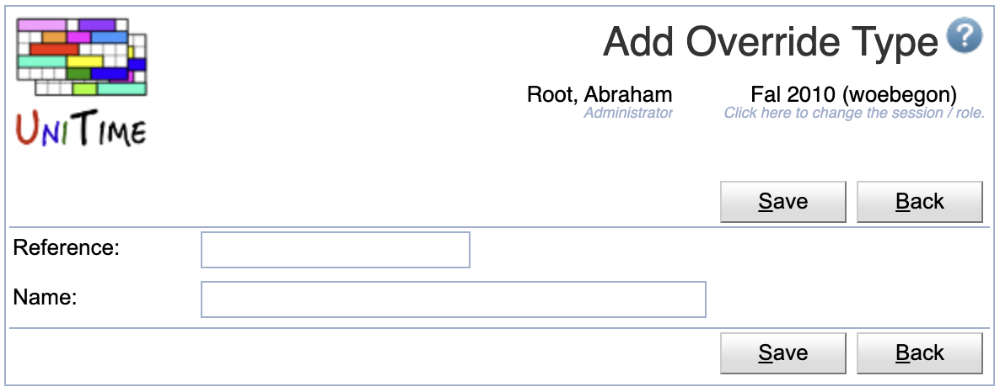

## Screen Description
The Add Override Type page allows the creation of a new override type.

{:class='screenshot'}

## Details

* **Reference**
	* The code used by the Student Information System to apply the override type.

* **Name**
	* A description of the override type

## Operations

* **Save**
	* Save the new override type and go back to the [Override Types](override-types) screen

* **Back**
	* Go back to the [Override Types](override-types) screen without saving this new override type

