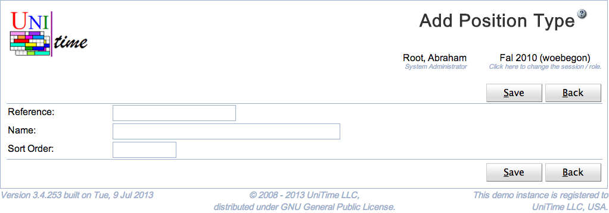

## Screen Description

 The Add Position Type page can be used to create a new position type. Each instructor can have a position type defined. The user needs Position Type Edit permission to be able to edit position types. See [Position Types](position-types) page for more details.

## Details

 Each position type has a reference, a name, and a number that is used for ordering position types. All fields are required and must be unique.

## Operations

 Click **Save** to create the new position type. The button **Back** will get you back to [Position Types](position-types) page without creating any new position types.

{:class='screenshot'}
