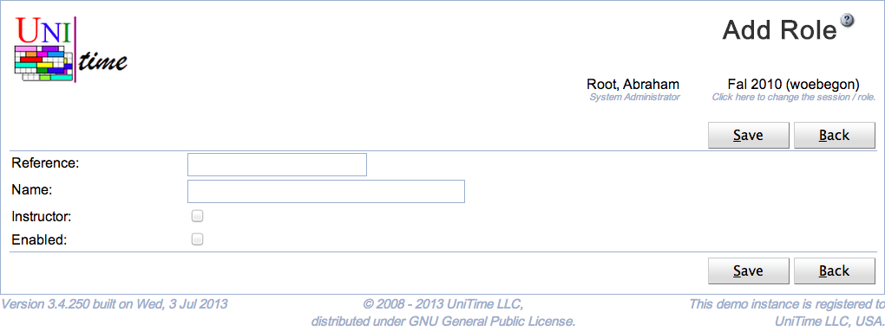

## Screen Description

 The Add Role page can be used to create a new role. Such a role can be assigned to UniTime managers ([Timetable Managers](timetable-managers) page) or instructors ([Instructor Roles](instructor-roles) page). The user needs to have Role Edit permission to be able to edit roles. Permissions of a role can be defined on the [Permissions](permissions) page. See [Roles](roles) page for more details.

## Details

 A role has a reference and a name. When Instructor toggle is checked, the role can be assigned to an instructor (or any departmental personell) using the Instructor Roles page. When the toggle is unchecked, the role can be only used on the [Timetable Managers](timetable-managers) page. Roles that are not enabled can be assigned to managers (or instructors), but they will not get assigned to the authenticated users.

## Operations

 Click **Save** to create the new role. The button **Back** will get you back to [Roles](roles) page without creating any new roles.

{:class='screenshot'}
