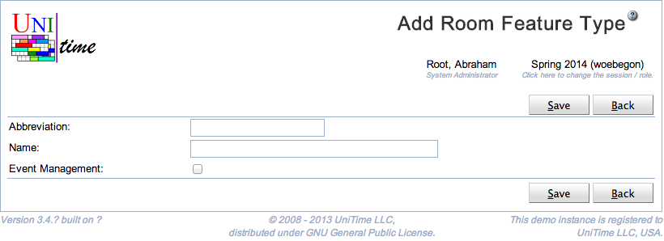

## Screen Description

 The Add Room Feature Type page can be used to create a new room feature type. Room feature types are used to categorize room features (each room feature can have a room feature type defined, e.g., seating arrangement, black board size). See [Room Feature Types](room-feature-types) for more details.

 The user needs to have Room Feature Type Edit permission to be able to edit room feature types.

## Details

 Room feature type has an abbreviation and a name. Both fields are required and need to be unique within the list of existing room feature types. The Event Management can be used to hide some of the less useful features from event management. Such room features will not show up in the [Room Filter](events-room-filter) component (e.g., on the [Events](events) page).

## Operations

 Click **Save** to create the new room feature type. The button **Back** will get you back to [Room Feature Types](room-feature-types) page without creating any new room feature types.

{:class='screenshot'}
