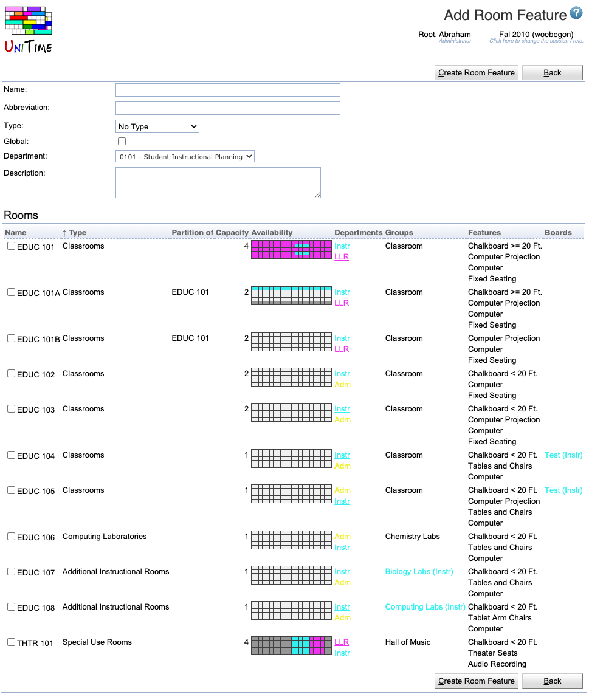

## Screen Description

In the Add Room Features screen, you can add room features for the rooms of your department(s). To indicate which rooms have this new feature, you will need to click on that feature in the [Room Features](room-features) screen after you have added it to your list by clicking on the Add New button in the current screen.

{:class='screenshot'}

## Details

* **Name**
	* Name the feature in a way that is helpful to you

* **Abbreviation**
	* Enter abbreviation that will be displayed in the [Rooms](rooms) screen

* **Type**
	* Room feature type
	* The field only appears if there are some room feature types defined on the [Room Feature Types](room-feature-types) administration page.
	* Room feature types can be used to categorize room features (seating arrangement, black board size, etc.). It defaults to No Type (no room feature type selected).

* **Global** (admin)
	* The administrator can decide whether this feature is global or not

* **Department**
	* Indicates which department wants to work with this feature (select the department from the drop-down list if you have more than one department; otherwise this field is pre-populated for you)

* **Description**
	* Optional description of the room feature

* **Rooms**
	* The list of rooms (following the **Filter** from the [Room Features](room-features) screen page)
	* Check the rooms that have the feature

## Operations

* **Create Room Feature**
	* Add this new room feature to your list of features and go back to the [Room Features](room-features) screen

* **Back**
	* Go back to the [Room Features](room-features) screen without adding any new feature
