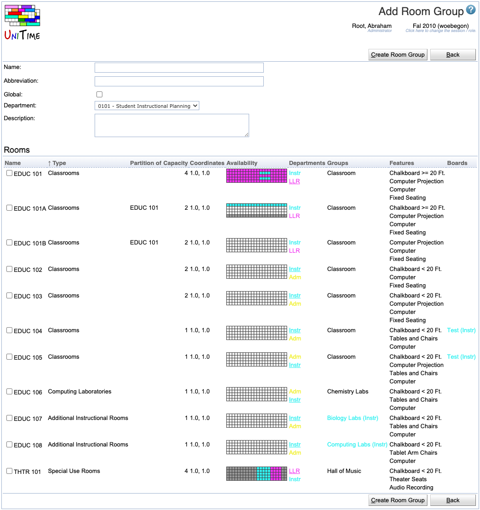

## Screen Description
In the Add Room Group screen, you can add a room group for the rooms of your department. To indicate which rooms should be in this new group, you will need to click on that group in the [Room Groups](room-groups) screen after you have added it to your list by clicking on the Add New button in the current screen.

{:class='screenshot'}

## Details

* **Name**
	* Name the group in a way that is helpful to you

* **Abbreviation**
	* Enter abbreviation that will be displayed in the [Rooms](rooms) screen

* **Global** (admin)
	* The administrator can decide whether this room group is global or not

* **Department**
	* Indicates which department should be able to work with this room group (select the department from the drop-down list if you have more than one department; otherwise this field is pre-populated for you)

* **Description**
	* The description should help you remember your intentions with this group; you can enter anything that is helpful to you

## Operations

* **Add New** (Alt+A)
	* Add this new room group to your list of room groups and go back to the [Room Groups](room-groups) screen

* **Back** (Alt+B)
	* Go back to the [Room Groups](room-groups) screen without adding any new room group
