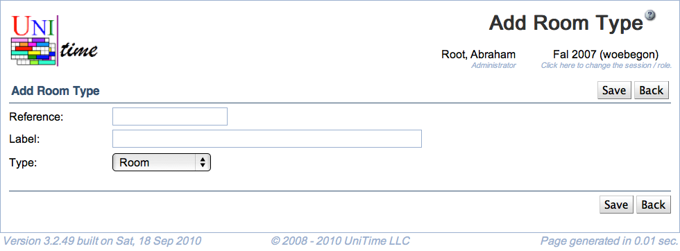

## Screen Description

 The Add Room Type screen provides interface for adding a new room type.

## Details

* **Reference**
	* Name under which the room type is recognized internally by the application
	* Should be implemented if it is to be used
		* It is used in XML import of buildings and rooms (scheduledRoomType attribute)

* **Label**
	* Name of the room type that is displayed in other screens throughout the application (for example, in the [Add Event](add-event) screen)

* **Type**
	* Type of location (currently it is either Room or Other Location - the latter used for the type Outside Location)
		* Room type is used for rooms in university space inventory (rooms within buildings)
		* Other location type is used for non-university and/or outside locations (spaces without buildings)

## Operations

* **Save** (Alt+S)
	* Save the new room type and go back to the [Room Types](room-types) screen

* **Back** (Alt+B)
	* Go back to the [Room Types](room-types) screen without saving the new room type

{:class='screenshot'}
