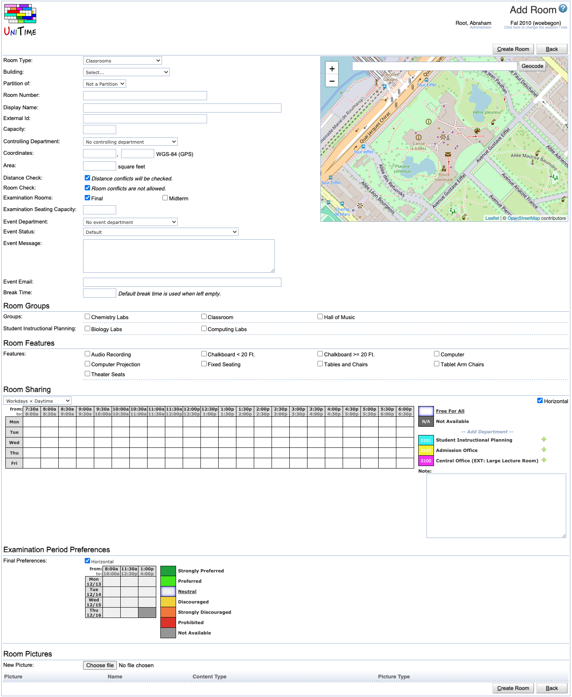

## Screen Description

The administrative page Add Room allows the administrator to add a new room in any existing building (a building can be added from the [Buildings](buildings) screen). Schedule managers may use the page to add locations that are not on campus (or not in the room inventory).

{:class='screenshot'}

## Details

* **Room Type**
	* Room type (only room types of the same type, room or non-university location, can be selected)

* **Building**
	* Building of the room (if room type is selected)

* **Name**
	* Room number (in case of a room) or the location name (in case of a non-university location)

* **Display Name** (optional)

* An alternative name of the room or non-university location

* **External Id** (optional)
	* External Id of the room

* **Capacity**
	* Seating capacity of the room (the maximum number of students who can have a class there at the same time)

* **Controlling Department** (optional)
	* The department which has the authority to set up sharing of the room with other departments
	* Pick the controlling department from a drop down list
	* **NOTE:** Each room must be associated with at least one department, either using the controlling department, event department, or the room sharing

* **Coordinates** (optional)
	* Location coordinates of the room on the campus map or GPS coordinates or other (the type of coordinates to use can be changed through the application setting unitime.distance.ellipsoid)
	* The coordinates are used to calculate distances between rooms (to decide whether the students and instructors can reach that room during the break from their previous location)
	* Distance between two rooms is computed as [Euclidean distance](http://en.wikipedia.org/wiki/Euclidean_distance) between coordinates
	* A room with no coordinates is assumed to be too far from any other room (for instructor and student back-to-back constraints)
		* If you do not have coordinate system established, entering the same coordinates (e.g., [0,0]) for all rooms will ensure that there will be no "too far" instructor and student back-to-back constraint violations in the problem.
	* If GPS coordinates are used, room position can be also selected (or modified) using the map on the right hand side.

* **Area** (optional)
	* Area of the room
	* The default is square feet, it can be changed through the localization

* **Distance Check**

* By default checked, which means that the distance is checked between classes in this location and other classes (to see if students and instructors can manage to get from one class to another)

* When unchecked, there is no time conflict between following classes (e.g. one at this location, the other one e.g. on campus) and the classes can be taught by the same instructor

* **Room Check**
	* By default checked, meaning that there can be only one class in this room at a time
	* When unchecked, more than one class is allowed at that location at the same time
	* Can be changed by the schedule deputy only for Non-University locations, for other rooms it is an administrative change

* **Examination Room** (optional)
	* Check whether this room can be used for examinations (for final examinations check the Final Examinations checkbox, for midterm examinations the Midterm Examinations checkbox, etc.)

* **Exam Seating Capacity** (required when the room is also an examination room)
	* The maximum number of students who can take an examination in that room at the same time
	* In many cases this number can reflect alternate seating (every other chair in the room is used for examinations)

* **Event Department** (optional)
	* The department that manages events in this room

* **Event Status** (optional)
	* The status of the room for event management
	* The default statuses for departments and room types are defined in the [Event Statuses](event-statuses) screen
	* The default is taken from the (department, room type) pair, can be overridden on a particular location

* **Event Message** (optional)
	* Note on the room
	* Displayed in Events when someone requests this room

* **Break Time** (optional)
	* The break time for events - the time needed after an event to get the room to the stage when the next group can use it (it includes the time during which attendees should leave the room, the chairs are put back, etc.)
	* The default is taken from the (department, room type) pair, can be overridden on a particular location

* **Room Groups**
	* Room groups of this location

* The list of groups is divided into **Global Groups** and **Departmental Groups** (if the schedule manager has added any groups for his/her department)

* **Room Features**
	* Room features of this location
	* The list of room features is divided by **Room Feature Types**

* **Room Sharing**
	* The Room Sharing table allows the department which controls the room to set up room sharing with other departments and the availability of the room at particular times.

* In the drop down menu right under the Room Sharing section (above the time grid), you can select what times you want to see in the time grid.

* The main part of this section is the time grid in which you can specify the room availability for different departments as follows:
	* Click on the colored rectangle next to the department to which you want to assign a particular time/times; then click on the times in the time grid (they will be filled with the color when you do)

* **Hint:** to select the whole day, click on the name of the day; to select a particular time across all days, click on that time; to select the whole time grid, click on the "from: to:" in the upper left hand side corner of the grid
	* You can also mark certain times as not available for any department (click on the gray rectangle next to **Not Available** in the legend and then click on those particular squares in the time grid)
	* **Note:** all the times that are left as **Free For All** are available to all the departments listed next to the time grid; the department which commits their timetable first will have the room at the times they pick

* To add a department to the list of departments that can share the room, select that department from the drop down list under the time grid and click the + icon**.**

* To remove a department from the list of departments that can share the room, select that department from the drop down list under the time grid and click the - icon.

* **Room Preference**

* By selecting the preference next to the department in the **Room Sharing**, you can indicate whether a given room should be used more or less often than other available rooms.

* You can pick the preference level for a given room for a given department (the preference you set is for your department only - if for example two departments share a room, one of them may discourage the usage of that room while the other one can just use the default **Neutral** preference).

* The meaning of the preference levels is as follows:
	* **Prohibited** – never ever use this room (even if required on a class)
	* **Strongly discouraged** – this room is used only if either
		* The room is required for a class, or
		* The room is preferred or strongly preferred for a class and the solver is not able to put this class into another room
	* **Discouraged** – this room is used if either
		* The room is required for a class, or
		* The solver is not able to put this class into another room
		* **Note:** The difference between Strongly Discouraged and Discouraged is that for Strongly Discouraged, a room can only be used if there is a preference set on a class or subpart for this room, while with Discouraged, the timetabling solver can put a class into this room no matter whether there is a preference for this room on a class or not (e.g., when there is not enough space in other rooms to accommodate all your classes)
	* **Neutral** – the default value for room preference
	* It is not recommended that you use **Preferred** or **Strongly Preferred**.
		* If you do use these preference levels, it will mean that all of your classes will have this room as preferred (or strongly preferred), unless you change the preference in the class preferences

* **Final Examination Periods Preferences**
	* Available when the room is marked as final examination room.
	* Indicate in the period grid which periods are preferred/discouraged/prohibited in that room for final examinations (click on the appropriate square in the legend and then on a square in the time grid)
	* The solver will try to put examinations into this room in preferred periods and not in discouraged periods

* **Midterm Examination Preferences**
	* Available when the room is marked as midterm examination room.
	* Indicate in the period grid which periods are preferred/discouraged/prohibited in that room for midterm examinations (click on the appropriate square in the legend and then on a square in the time grid)

* **Event Availability**
	* Available when an event department is selected.

* The **Event Availability** can be used to define global unavailability of a room for the event management. 

* If a particular time (e.g., Friday 7:30am - 6:30pm) is marked as unavailable, the room is not available during this time every week (e.g., every Friday between 7:30am and 6:30pm). For a less repetitive unavailabilities an unavailability event can be created. See [Add Event](http://help41.unitime.org/Add_Event) page for more details.

* Click Available or Not Available in the legend to make a selection. When a particular time is clicked, it is changed to the selected type (either available or not available). All times (that are visible) can be changed by clicking the appropriate day of week, all (visible) days can be changed by clicking the appropriate time. Visible days and times can be changed in the drop down on the top left side. Horizontal or vertical mode can be changed by clicking the Horizontal check box on the top right side. The visible days and times and the horizontal / vertical mode are remembered in the browser cookie.

* Permission Edit Room Event Availability is needed to be able to edit the event availability. Permission Room Detail Event Availability is needed to see event room availability on the [Room Detail](http://help41.unitime.org/Room_Detail) page.

* **Room Pictures**
	* One or more files can be attached to a location using this section.
	* Different files can be categorized by [Attachment Types](attachment-types), which also drives
	* Please note that any attachments are not modified in any way. It is hence desired to attach room pictures in resolution that can be used in the  element (files should not be very large).

## Operations

* **Save** (Alt+S)
	* Save the new room and go back to the [Rooms](rooms) screen

* **Back** (Alt+B)
	* Go back to the [Rooms](rooms) screen without saving any changes
