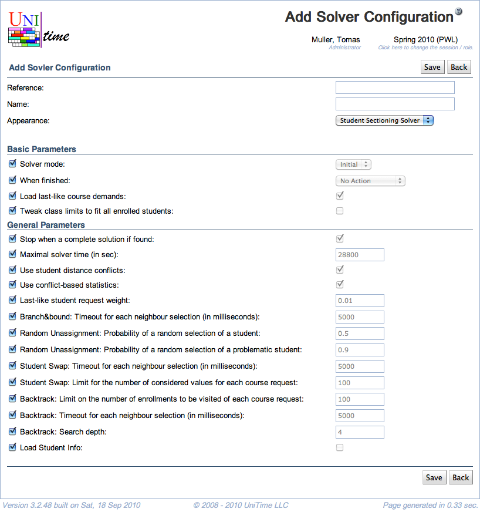

## Screen Description

In the Add Solver Configuration screen, it is possible to set up a new solver configuration by setting values of solver parameters.

{:class='screenshot'}

## Details

The top part of the screen allows to enter

* **Reference**
	* Unique name of the configuration

* **Name**
	* Name of the configuration which is displayed in the screens where the configuration is used

* **Appearance**
	* Names of screens in which this configuration appears (can be used)

The rest of the screen contains solver parameters grouped into solver parameter groups. The default value is set for each parameter. To change it, uncheck the checkbox in front of the parameter name and then change the value at the end of the line.

## Operations

* **Save** (Alt+S)
	* Save the new solver configuration and go back to the [Solver Configurations](solver-configurations) screen

* **Back** (Alt+B)
	* Go back to the [Solver Configurations](solver-configurations) screen without saving any changes
