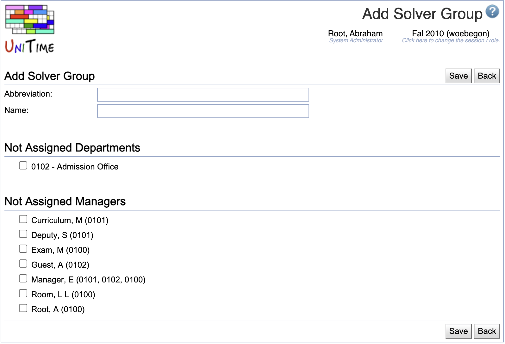

## Screen Description

The Add Solver Group screen provides interface for adding a new solver group.

{:class='screenshot'}

The new solver group can include only departments that are not a part of another solver group. It can include any existing managers.

## Details

* **Abbreviation**
	* Solver group abbreviation (displayed e.g. in the [Timetables](timetables) screen)

* **Name**
	* Name of the solver group

* **Not Assigned Departments**
	* A list of departments that are not a part of any other solver group (only such departments can be used for a new solver group)
	* Check any departments you want to include

* **Not Assigned Managers**
	* A list of all schedule managers
	* Check any schedule managers who should be allowed to create (and save and commit) timetables for the solver group

## Operations

* **Save**
	* Save the new solver group and go back to the [Solver Groups](solver-groups) screen

* **Back**
	* Go back to the [Solver Groups](solver-groups) screen without saving this new solver group
