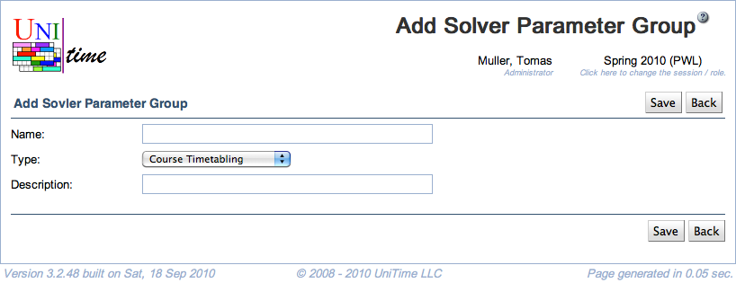

## Screen Description

 The Add Solver Parameter Group screen provides interface for adding a new solver parameter group.

## Details

* **Name**
	* Name of the solver parameter group

* **Description**
	* Description of the solver parameter group (should indicate the type of parameters in this group)

## Operations

* **Save** (ALT+S)
	* Save the new solver parameter group and go back to the [Solver Parameter Groups](solver-parameter-groups) screen

* **Back** (ALT+B)
	* Go back to the [Solver Parameter Groups](solver-parameter-groups) screen without saving this new solver parameter group

{:class='screenshot'}
