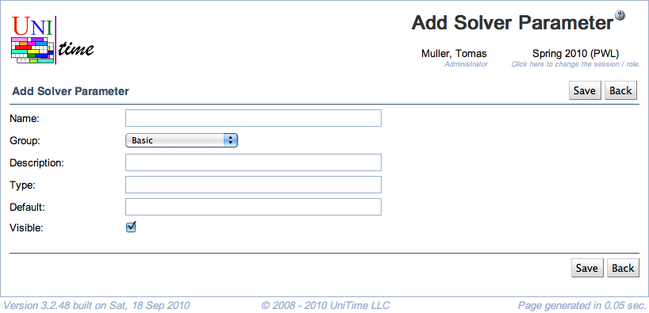

## Screen Description
The Add Solver Parameter screen provides interface for adding a new solver parameter. Note, however, that a parameter should be implemented and recognized by the solver before it is added here.

{:class='screenshot'}

## Details

* **Name**
	* Unique name of the parameter
	* The convention is that the first part should reflect the parameter group (for example, solver mode in the Basic group is named Basic.Mode)

* **Group**
	* You can change the group for the parameter (by default there is a group from the section where you clicked on Add Solver Parameter)

* **Description**
	* Description of the parameter, as displayed e.g. in the [Edit Solver Configuration](edit-solver-configuration) screen

* **Type**
	* Type of the parameter
		* For example, when the type is boolean, the value can be set by checking or unchecking a checkbox

* **Default**
	* The default value of the parameter (can be later changed by administrator in the [Edit Solver Configuration](edit-solver-configuration) or [Add Solver Configuration](add-solver-configuration) screen or, in the Basic group, by any user in the [Solver](solver) screen for a particular solver run)

* **Visible**
	* If checked (default), this parameter is a part of the configuration settings (can be changed in the [Add](add-solver-configuration)/[Edit Solver Configuration](edit-solver-configuration) screens)
	* If unchecked, the default value of the parameter cannot be changed anywhere but in the [Edit Solver Parameter](edit-solver-parameter) screen

## Operations

* **Save** (Alt+S)
	* Save the new solver parameter and go back to the [Solver Parameters](solver-parameters) screen

* **Back** (Alt+B)
	* Go back to the [Solver Parameters](solver-parameters) screen without saving this new parameter
