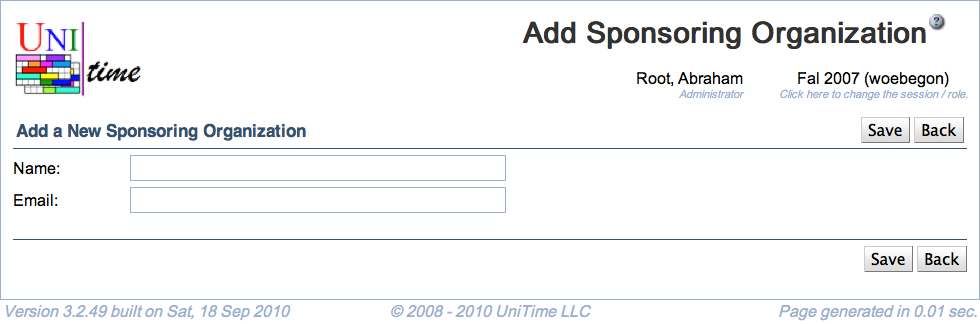

## Screen Description
Interface for adding a new sponsoring organization (to be used in event management).

{:class='screenshot'}

## Details

* **Name**
	* Name of the sponsoring organization
	* Mandatory

* **Email**
	* Contact email for the sponsoring organization
	* Not mandatory (but recommended - when an event is changed that is sponsored by an organization that provided an email address, a confirmation email is sent to that address)

## Operations

* **Save** (Alt+S)
	* Save the new sponsoring organization and go back to the [Sponsoring Organizations](sponsoring-organizations) screen

* **Back** (Alt+B)
	* Go to the [Sponsoring Organizations](sponsoring-organizations) screen without saving the new organizatio
