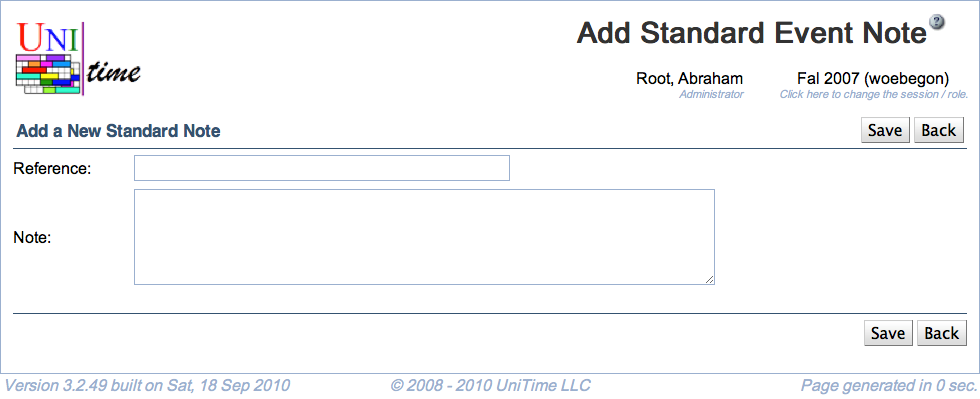

## Screen Description

Interface for adding a new standard event note (to be used when approving/rejecting an event in the [Event Detail](event-detail) screen)

{:class='screenshot'}

## Details

* **Reference**
	* Short description of the note (e.g., used on [Event Detail](event-detail) page to order the notes)

* **Note**
	* Text of the note

* **Applies To**
	* Global: Event note is available to all event managers and administrators across all the academic sessions
	* Session: Event note is available to all event managers and administrators in the particular academic session
	* Department: Event note is available to event managers and administrators when approving events from the selected department

## Operations

* **Save** (Alt+S)
	* Save the new standard event note and go to the [Standard Event Notes](standard-event-notes) screen

* **Back** (Alt+B)
	* Go to the [Standard Event Notes](standard-event-notes) screen without saving the new note

