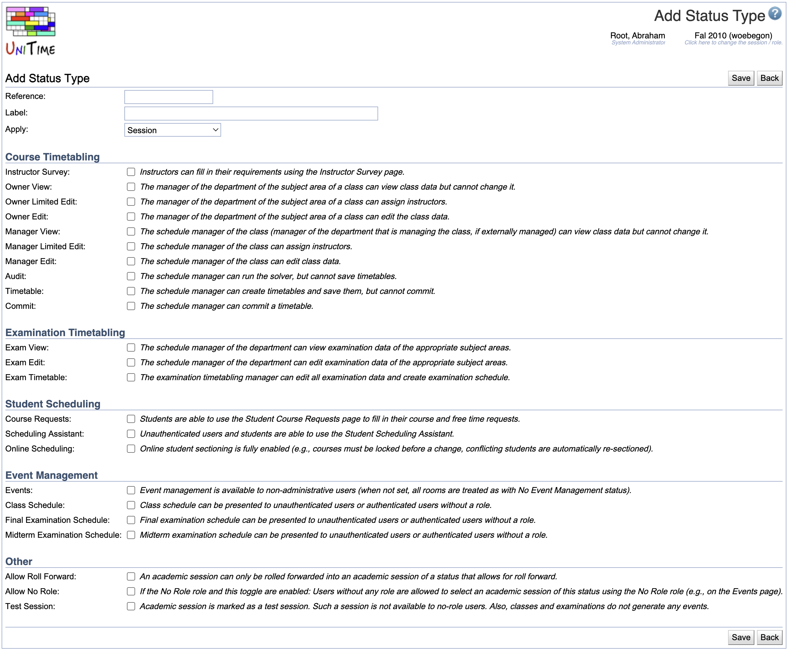

## Screen Description

The Add Status Type screen provides interface for adding a new status. Each status is defined by the rights the managers or owners have regarding viewing and/or editing their data. Each right has its description in the screen.

{:class='screenshot'}

## Details

* **Reference**
	* The name under which the application recognizes the status internally

* **Label**
	* Name of the status displayed throughout the application (for example, in the [Academic Sessions](academic-sessions) screen)

* **Apply**
	* Choose whether a given status should be applicable only to a session, only to a department, or to both (for example, "Initial Data Load" applies to a session only while "External Manager Timetabling" applies to a department only)

The rights are divided into several categories:

* **Course Timetabling**
	* Owner/manager rights related to creating a course timetable

* **Examination Timetabling**
	* A set of rights related to (final/midterm) examination timetabling

* **No-Role Reports**
	* Specify what can be done by users who do not have a role in the timetabling application.

## Operations

* **Save** (Alt+S)
	* Save this new status type and go back to the [Status Types](status-types) screen

* **Back** (Alt+B)
	* Go back to the [Status Types](status-types) screen without saving this new status

