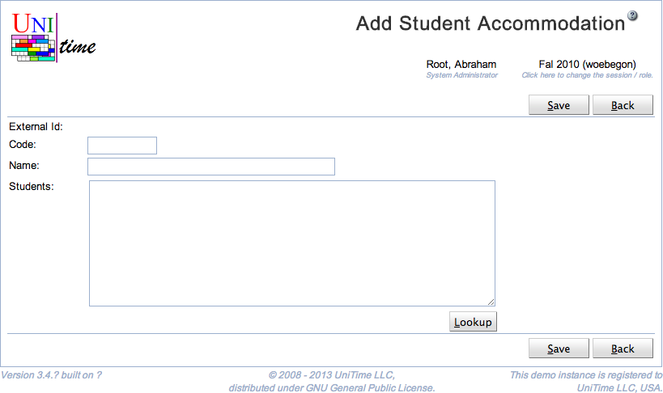

## Screen Description

The Add Student Accommodation screen provides interface for adding a new student accommodation without an External Id (accommodations with External Id can only be imported and their External Id is not editable in UniTime). See [Student Accommodations](student-accommodations) for more details about student accommodations.

{:class='screenshot'}

## Details

* **External Id**
	* Not editable in UniTime

* **Code**
	* Code or abbreviation of the accommodation 
	* Used in UniTime to identify the accommodation (displayed in various screens etc.)

* **Name**
	* Name of the accommodation

* **Students**
	* A list of students with this accommodation
	* It is possible to use the **Lookup** button and look the students up one by one or to copy a list of External Ids of the students to the text field
		* The Lookup button takes you to the [People Lookup](people-lookup) screen

## Operations

* **Save**
	* Save the new student accommodation and go back to the [Student Accommodations](student-accommodations) screen

* **Back**
	* Go back to the [Student Accommodations](student-accommodations) screen without saving the new student accommodation

