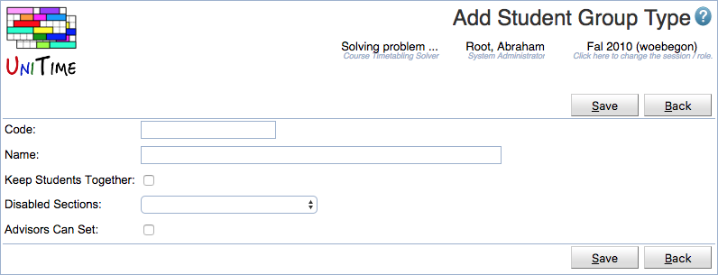

## Screen Description

 The Add Student Group Type page allows create a new student group type. This way, student groups can be grouped by their type. There are additional properties that can be defined for each group of a particular type.

## Details

 Each student group type can have a code, a name, and the following properties:

* **Keep Students Together**
	* When set to true, the student scheduling solver will try to keep students of such groups together.

* **Disabled Sections**
	* It is possible for certain student groups to allow students to enroll in classes that are disabled for student scheduling. The possible values are:
	* **Not Allowed**: students of such group are not allowed to see or enroll in disabled classes (this is the default)
	* **Allowed With Group Reservation**: students of such a group can enroll in a disabled class if there is a student group reservation for their group
	* **Allways Allowed**: students of such a group can enroll in any disabled class

* **Advisors Can Set**
	* Advisors and admins can use the [Online Student Scheduling Dashboard](online-student-scheduling-dashboard) to add or remove a student from a group of this type

## Operations

* **Save**
	* Save the new student group type and go back to the [Student Group Types](student-group-types) screen

* **Back**
	* Go back to the [Student Group Types](student-group-types) screen without saving this new status type

{:class='screenshot'}
