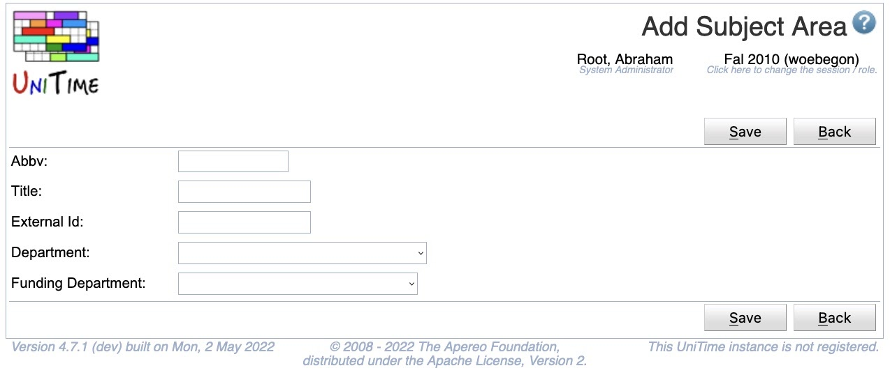

## Screen Description

The Add Subject Area screen provides you with interface for adding a new subject area.

{:class='screenshot'}

## Details

* **Academic Session**
	* The academic session for which you are adding a new subject area
	* Can be changed from the [Academic Sessions](academic-sessions) screen

* **Abbreviation**
	* Subject area abbreviation

* **Title**
	* Title of the new subject area

* **External ID**
	* External ID of the subject area (optional)

* **Department**
	* Select an existing department to which the subject area belongs (a subject area has to belong to a department)
		* A new department can be added in the [Add Department](add-department) screen - to get there, click on Departments in the Administration section of the left hand side menu

* **Funding Department**
	* The department funding the classes for this subject area if they are funded by a department other than the department to which the subject area belongs.
		* This field is not visible by default.  To enable this field the unitime.courses.funding_departments_enabled application property must be set to true.

## Operations

* **Save** (ALT+S)
	* Save the new subject area and go back to the [Subject Areas](subject-areas) screen

* **Back** (ALT+B)
	* Go back to the [Subject Areas](subject-areas) screen without saving any changes

