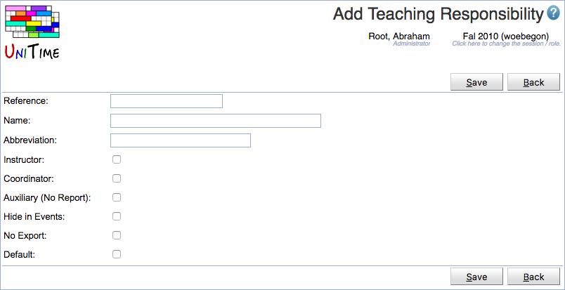

## Screen Description

 The Add Teaching Responsibility page can be used to create a new teaching responsibility. Both instructor and coordinator assignments can have a teaching responsibility defined (optional). This allows, for instance, to distinguish between instructors, teaching assistants, course supervisors, graders, and other roles.

 The user needs to have Teaching Responsibility Edit permission to be able to create a new teaching responsibility. See [Teaching Responsibilities](teaching-responsibilities) for more details.

## Details

 Beside of reference, name, and abbreviation, there is a flag defining whether the responsibility can be used on an instructor (Instructor column), on a coordinator (Coordinator column), whether the assignment should be visible in the reports (Auxiliary), not visible in the event management (Hide in Events) or not exported / sent to an external system (No Export).

## Operations

 Click **Save** to create the new teaching responsibility. The button **Back** will get you back to [Teaching Responsibilities](teaching-responsibilities) page without creating any new responsibilities.

{:class='screenshot'}
