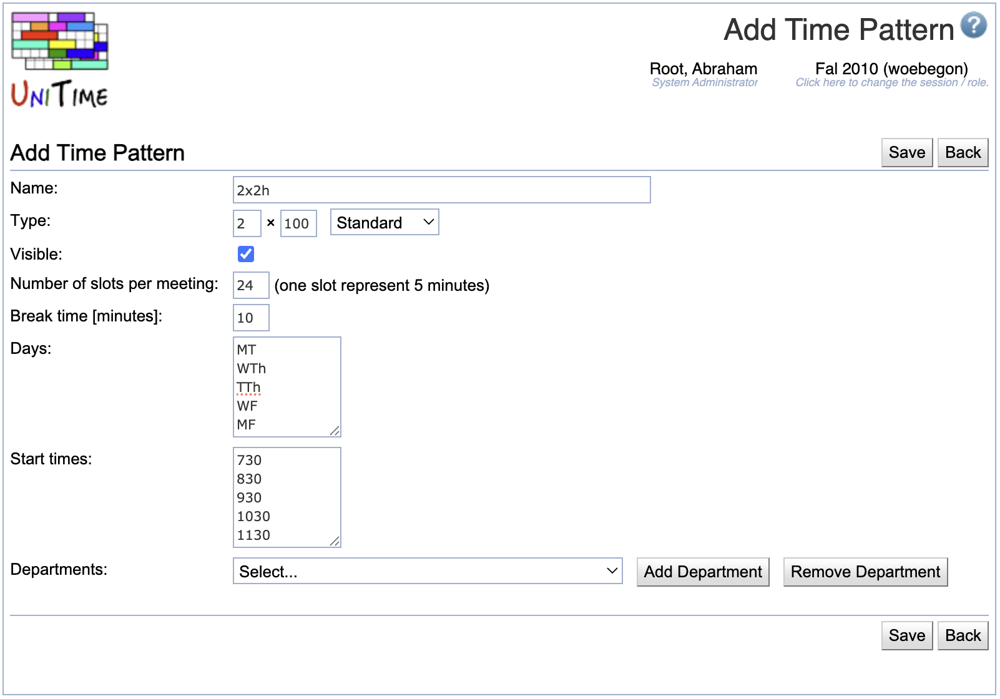

## Screen Description

The Add Time Pattern screen provides interface for adding a new time pattern.

{:class='screenshot'}

A time pattern defines how many times a week a class meets for how many minutes and how much time should be allocated for a break when the class is over.

## Details

* **Name**
	* Name of the time pattern (e.g., 1 x 50)

* **Type**
	* The format is "Number of meetings per week" x "Number of minutes per one meeting"; then select the range of times of day from the drop down menu; the range is for users' information only, since times of day are specified below
		* If the type is Extended, only explicitly indicated departments (and administrators) have access to this time pattern (this time pattern is not visible as an option on classes and scheduling subparts that are managed by departments not listed on this time pattern)

* **Visible**
	* When checked (checked by default), the time pattern will be available to users authorized to use it
	* When not checked, the time pattern will not be available for the given academic session and will be displayed in gray letters in the list of time patterns

* **Number of slots per meeting**
	* Number of five minute blocks necessary for the meeting
		* The number should include break time after the actual meeting time; for example, if a class meeting lasts 50 minutes and then there should be a 10 minute break, the number of slots is 12

* **Break time [minutes]**
	* Indicate how many minutes from the end of the time allocated to the meeting (number of slots x 5) should be reserved for a break (in the example with a 50 minute slot, the break time would be 10 minutes - meaning that the last two slots out of 12 are actually a break time)

* **Days**
	* List days of week (or combinations of days of week) which should be available for the time pattern
	* The format of possible days is Mon, Tue, Wed, Thu, Fri, Sat, Sun or M, T, W, Th, F, S, Su (each day or combination of days (e.g., MWF) on a separate line or on one line, separated by commas)

* **Start times**
	* List possible starting times in military format without separating hours and minutes (for example, "0700", "1530", etc.), each start time on a new line (or all of them on one line, separated by commas)

* **Departments**
	* If the time pattern is of type Extended, indicate departments which should have access to this time pattern

## Operations

* **Save**
	* Save the new time pattern and go back to the [Time Patterns](time-patterns) screen

* **Back**
	* Go back to the [Time Patterns](time-patterns) screen without saving this new time pattern

