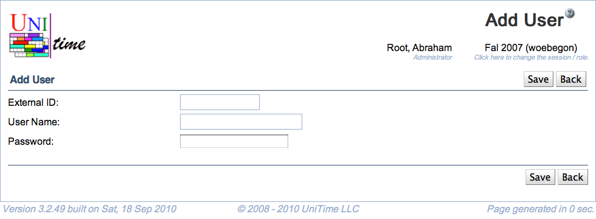

## Screen Description

The Add User screen provides interface for entering authentication data for users in case the timetabling application is not connected to any external database for this purpose.

{:class='screenshot'}

## Details

* **External ID**
	* Enter new user's ID to be used in this application (must be unique)

* **User Name**
	* Enter the user's login name (must be unique)

* **Password**
	* Enter the user's password

## Operations

* **Save**
	* Save this new user's authentication data and go back to the [Users (Database Authentication)](users-database-authentication) screen

* **Back**
	* Go back to the [Users (Database Authentication)](users-database-authentication) screen without saving the new user

