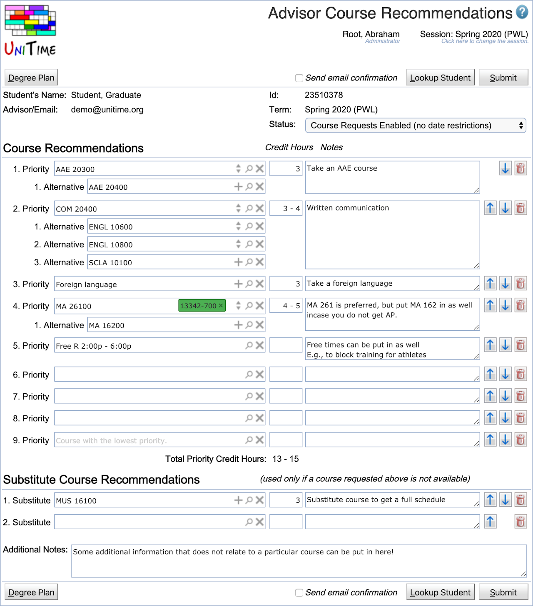
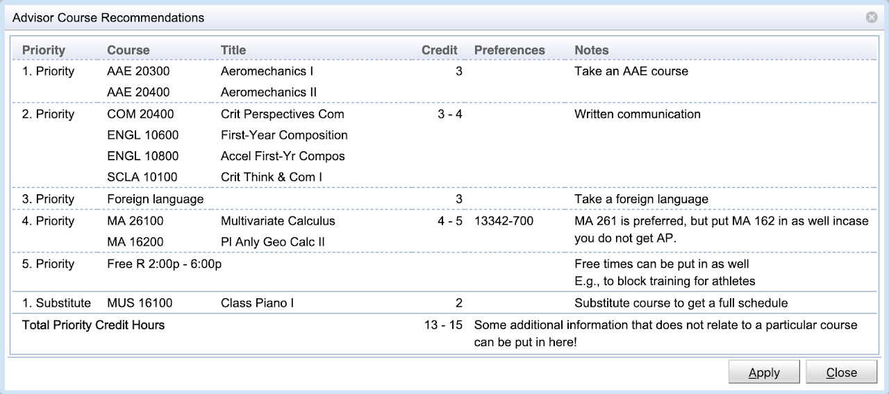
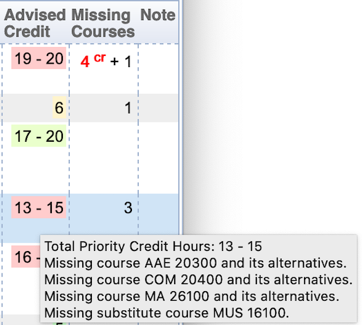
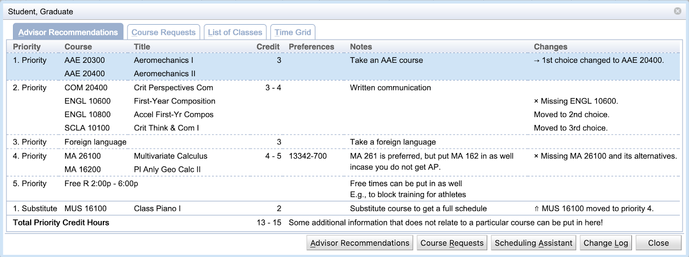

## Screen Description

The Advisor Course Recommendations is a page for the advisor to fill with a student while advising him/her on what courses to take the next term. It looks a lot like the [Student Course Requests](student-course-requests) page, with a few fields added (credits per course, notes, etc.).

{:class='screenshot'}

When opened, the advisor can look up a student and the page gets pre-populated with the existing data. A different student can be looked up also by clicking the **Lookup Student** button or when the student name or id is clicked. If advisor course recommendations from multiple academic sessions can be viewed and/or edited, an academic session can be selected afterward. It can be changed at any time by clicking the term field. When there are any unsubmitted changes, the user is prompted when leaving the page or changing student or session.

Just like on the [Student Course Requests](student-course-requests), the page automatically offers course suggestions as the course name is being typed in (but it is possible to put in a free text too), fills in credits, counts the credit totals, etc. When submitted, there is a PDF version generated that can be printed and signed by the student. It is also possible to email the document to the student (with the advisor on CC) when the page is submitted (and the Send email confirmation toggle is checked). In this case, the Send email... dialog pops up after the form has been successfully submitted and the user can provide additional message and email address if needed.

The page also allows for student status change when submitted. This eliminates the need for the advisor to also use the [Online Student Scheduling Dashboard](online-student-scheduling-dashboard) to change the student status (e.g., to let the student fill in his/her course requests). UniTime keeps a record of these advisor course recommendations for possible auditing/reporting (what students requested versus what they have been advised, list students that have been already advised that did not fill their course requests in, etc.). Some of these can be seen on the [Online Student Scheduling Dashboard](online-student-scheduling-dashboard).

## Operations

* Click on the **Lookup Student** to change the student. You can also lookup a student by clicking on the student's name or id.

* Click on the **Term** field to change the academic session. Previous academic sessions for which the student has advisor recommendations are available too, but they can be only viewed (past recommendations cannot be edited).

* Click on the **Degree Plan** button to see the degree plan (or plans) that are available to the student. It is possible to use the dialog to pull in courses from the selected plan.

* Click on the **Submit** button to submit the course recommendations. A PDF confirmation is generated. It is also possible to send an email to the student by checking the Send email confirmation toggle before hitting the **Submit** button.

## Other Pages: Students

The student's [Student Course Requests](student-course-requests) page will be automatically pre-populated with these course recommendations. This only happens when

* Application configuration property unitime.acrf.prepopulate.courseRequests is set to true (this is the default).

* The student has not made any changes to his/her course requests yet (there could be some other courses automatically pre-populated, e.g., the Learning Community courses).

* The student can submit the page (he/she has permission to click the **Submit** button). This is to avoid confusion when the student is not allowed to make changes (so he/she cannot think he/she has the advisor recommendations put in already).

The student's [Student Scheduling Assistant](student-scheduling-assistant) page will be automatically pre-populated with these course recommendations. This only happens when

* Application configuration property unitime.acrf.prepopulate.schedulingAssistant is set to true (this is the default).

* The student has not made any changes to his/her course requests or class schedule yet (there could be some other courses automatically pre-populated, e.g., the Learning Community courses).

* The student is NOT enrolled in any classes yet (the Scheduling Assistant page is opened on the Course Requests table where the advisor recommendations are displayed).

{:class='screenshot'}

Any time there are any advisor course recommendations, there is the Advisor Recommendations button that the student can use to see review the recommendations and pull them in if desired.

## Other Pages: Advisors

When there are some students with advisor recommendations returned, additional fields are displayed on the Students tab of the [Online Student Scheduling Dashboard](online-student-scheduling-dashboard) page. These lists the number of advised primary credit hours, and the number of primary courses that the student is missing (they are listed among the advisor course recommendations but the student does not have them on his/her Course Requests form. Missing critical courses are indicated in **red** color. Additional information is available (e.g., listing the missing courses) as a tooltip or on the Advisor Recommendations tab when the student is clicked.

{:class='screenshot'}

Columns **Advised Credit** and **Missing Courses** have been added.

Please note that the background color in the **Advised Credit** column indicates how well are the advisor recommendations followed, going from green (completely followed) to orange to red (not followed at all). More details are available on the tooltip and when the student line is clicked.

It is also possible to filter students by **Advised**, **Not Advised**, and for the advisors also **My Students Advised**, **My Students Not Advised** modes in the Filter.

{:class='screenshot'}

It is also possible to open the Advisor Course Recommendations page for the student by clicking the student on the dashboard and using the **Advisor Recommendations** button. The Advisor Course Recommendations page opens in a new browser tab. It is possible to work with multiple students at the same time.

## Notes

The page requires the **Advisor Course Requests** permission. A user (typically an advisor) can look up and see advisor recommendations for all students, he/she may be only allowed to edit no students, only his/her students, or all students (depending on the Student Scheduling Advisor Can Modify All Students or Student Scheduling Advisor Can Modify My Students permissions).
