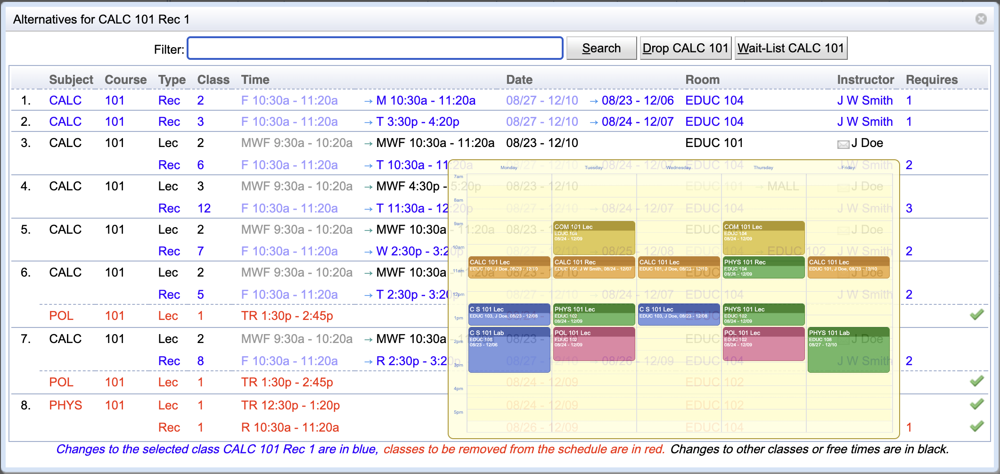

## Screen Description

The Alternatives screen offers alternatives for classes in the [Student Scheduling Assistant](student-scheduling-assistant) screen. Some alternatives may include changes in times/rooms of other classes, but in that case all changes are described as parts of the alternatives.

{:class='screenshot'}

## Details

There is color coding for the proposed changes

* Blue: the class on which the user clicked will be moved in time or room

* Black: another class will be changed, but it will still be a part of the student's timetable

* Red: a class will be removed from the student's timetable to make space for the suggested alternative; this way, it is also possible to assign a course with lower priority at the cost of removing a course with higher priority

Click on the alternative that should become a part of the timetable to apply the changes and get back to the [Student Scheduling Assistant](student-scheduling-assistant) screen. To leave the screen without applying any changes, click outside the Alternatives window.

