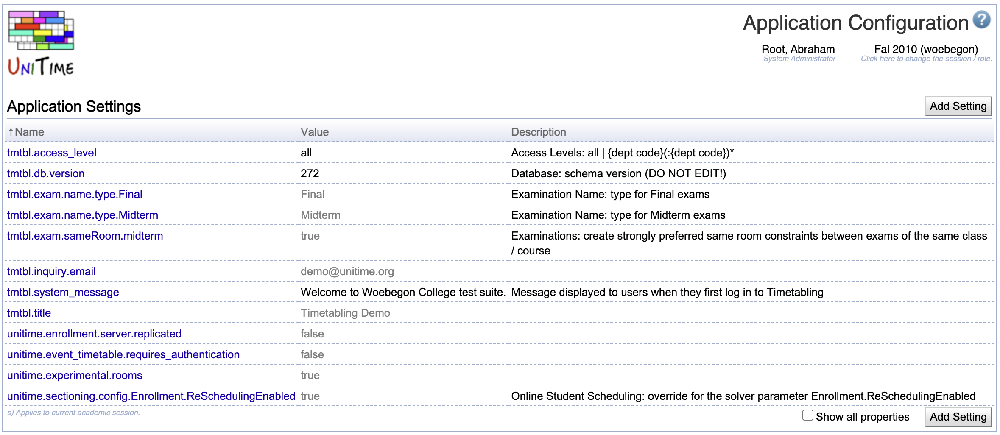
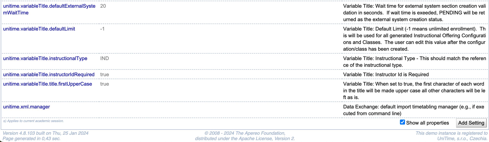
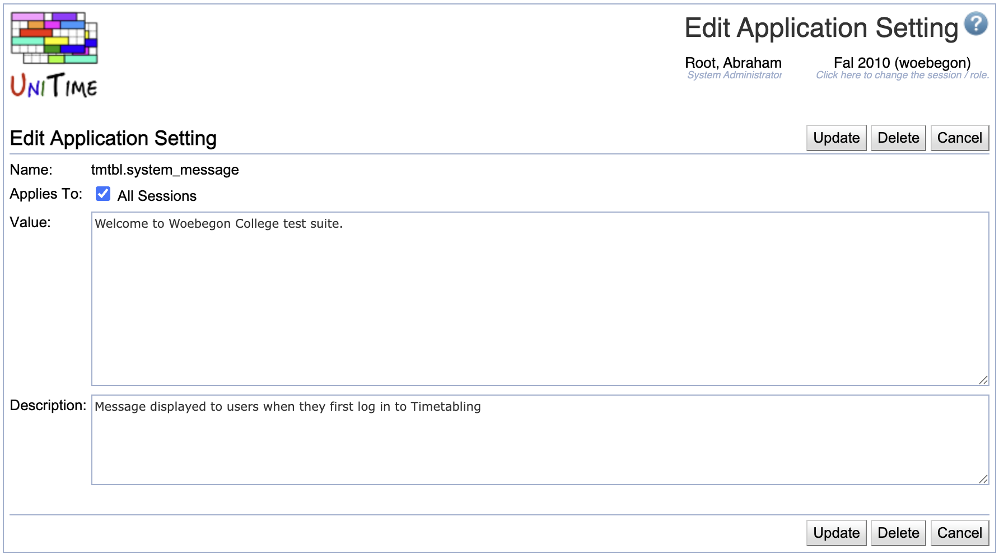

## Screen Description

The Application Configuration screen provides a list of application settings/properties together with their values. The settings can be edited through the application interface, while properties must be edited in a properties file. Read the Customization section of the [Timetabling Installation](installation#customization) instructions to see where and how to set up the application properties.

{:class='screenshot'}

## Application Settings

* **Name**
    * Name of the application setting as recognized by the application

* **Value**
    * Current value of the setting
    * The gray text means that the current value is not set on the Application Configuration page (it is either the default or it is set in the custom properties file)

* **Description**
    * Description of the application setting

When the **Show all properties** toggle is checked, all application properties (taken from the [ApplicationProperty](https://github.com/UniTime/unitime/blob/master/JavaSource/org/unitime/timetable/defaults/ApplicationProperty.java#L88) enum) are displayed. When not checked, only those that are set on this page or have a non-default value set in the [custom properties file](installation#customization) are displayed.

Most application settings are academic session independent, but it is possible to define session-dependent values. If the current session has a session-dependent value for a particular setting, this is denoted by s) next to the property name.

**Note:** Some of the application properties (e.g., database connection properties) cannot be changed through this interface; they must be changed in the [custom properties file](installation#customization).

**Note:** Changing most of the application settings will have an immediate effect on the application. Some settings may require a restart of the application.

**Note:** The Application Configuration page may also show application

## Operations

The table can be sorted by any column. Click the column header to sort the table. The second click on the same header will reverse the order.

### Add Application Setting

Click **Add Setting** to add a new application setting.

{:class='screenshot'}

**Applies To**: Which sessions the setting will affect. The setting is session-independent (applies to all academic sessions, except those which have a session-dependent value set), and the **All Sessions** toggle is checked. When the **All Session** toggle is unchecked, one or more academic sessions must be selected.

* Click **Save** to create the new application setting and return to the list of application settings.
* Click **Cancel** to go back to the list of application settings without making any changes.

### Edit Application Setting

Click on any application setting to change its value or description, or to delete the application setting.

{:class='screenshot'}

**Applies To**: Which sessions the setting will affect. The setting is session-independent (applies to all academic sessions, except those which have a session-dependent value set), and the **All Sessions** toggle is checked. When the **All Session** toggle is unchecked, one or more academic sessions must be selected.

* Click **Update** to update the application setting and return to the list of application settings.
* Click **Delete** to delete the application setting and return to the list of application settings.
    * A setting can only be deleted when it was set on the Application Configuration page.
    * If deleted, the setting value is changed back to the default or to what is set in the [custom properties file](installation#customization).
* Click **Cancel** to go back to the list of application settings without making any changes.
