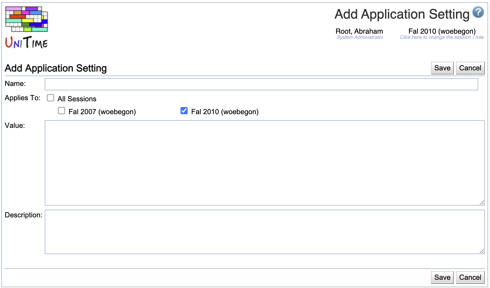

## Screen Description

The Application Configuration screen provides a list of application settings/properties together with their values. The settings can be edited through the application interface, while properties must be edited in a properties file. Read the Customization section of the [Timetabling Installation](installation) instructions to see where and how to set up the application properties.

{:class='screenshot'}
{:class='screenshot'}

## Application Settings

* **Name**
	* Name of the application setting as recognized by the application

* **Value**
	* Current value of the setting
	* Can be changed in the [Edit Application Setting](edit-application-setting) screen

* **Description**
	* Description of the application setting

Click on any application setting to get to the [Edit Application Setting](edit-application-setting) screen.

### Operations

* **Add Setting**
	* Add a new application setting
	* Note: A setting should be implemented and recognized by the application, see [application.properties](application-properties) for a list of implemented settings

## Application Properties

* **Name**
	* Name of the application property as recognized by the application

* **Value**
	* Current value of the application property

Note: To change an application property, add an application setting with the appropriate name (application settings take precedence over application properties). Some of the application properties (e.g., database connection properties) cannot be changed through this interface, they must be changed in the configuration files, see [Timetabling Installation](installation) page.

