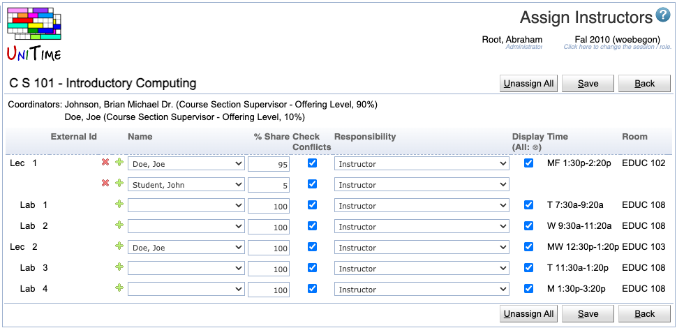

## Screen Description

 In Assign Instructors, you can enter instructor names for each of the classes and set some properties of this assignment. When you assign an instructor to a departmental class, the preferences of the instructor are automatically inherited on the class if the instructor is marked as lead and has instructor preferences (even if "Inherit instructor preferences on a class" is set to "ask" or "never" in [Manager Settings](manager-settings)). You can assign more than one instructor to a class. You can also go through the instructional offerings (configurations) one by one using Next and/or Previous buttons.

## Details

 There is a line (or more) for each class of that configuration of the instructional offering.

* **Trashbin icon**
	* Displayed only if there is more than one instructor for a given class
	* Click here to delete an instructor for a given class

* **Plus icon**
	* Click here to add another instructor for this class

* **Name**
	* Pick instructor's name from the list; the list is the same as the one you can see in the [Instructors](instructors) screen (and from which you select the instructor in the [Edit Class](edit-class) screen)
	* If you do not see an instructor in this list who should be assigned to a class, you need to add this person in [Instructors](instructors)

* **% Share**
	* Indicates the percentage of teaching activity for this class associated with this instructor
	* Used in official instructional reporting
	* The total for a class (if there are e.g. more instructors per class) should be 100

* **Check conflicts**
	* When checked (and it is checked by default), the instructor's preferences are considered during departmental timetabling; also, checks are performed for this instructor to make sure that this person does not have conflicting teaching assignments (i.e., he/she is not teaching another class at the same time)
	* When not checked, the instructor's association with this class is ignored during timetabling, no conflicts will be discovered between this class and his/her other classes

* **Display**
	* When checked (and it is checked by default), the instructor will be displayed in the online Schedule of Classes
	* When not checked, the instructor will not be displayed in the online Schedule of Classes - the instructors not to be displayed are in italics wherever the appropriate classes are listed ([Instructional Offerings](instructional-offerings), [Instructional Offering Detail](instructional-offering-detail), [Scheduling Subpart Detail](scheduling-subpart-detail), [Classes](classes), ...)
	* **All** - check or uncheck for all classes

* **Time**
	* Time assigned to this class during timetabling
	* Displayed only if there is a timetable (the loaded timetable is used; if no timetable is loaded, the selected one is used; if no timetable is selected, the committed one is used)

* **Room**
	* Room assigned to this class during timetabling
	* Displayed only if there is a timetable (the loaded timetable is used; if no timetable is loaded, the selected one is used; if no timetable is selected, the committed one is used)

* **Funding Department**
	* The department providing funding for this class.
	* This field is not visible by default.  To enable this field the unitime.courses.funding_departments_enabled application property must be set to true.

## Operations

* **Unassign All**
	* Unassign all instructors, save, and go back to the [Instructional Offering Detail](instructional-offering-detail) screen

* **Update** (Alt+U)
	* Save changes and go back to the [Instructional Offering Detail](instructional-offering-detail) screen

* **Previous** (Alt+P)
	* Save changes and go to the Assign Instructors screen for the previous instructional offering (configuration)
	* The button is displayed only if there is a "previous" instructional offering (configuration) to go to

* **Next** (Alt+N)
	* Save changes and go to the Assign Instructors screen for the next instructional offering (configuration)
	* The button is displayed only if there is a "next" instructional offering (configuration) to go to

* **Back** (Alt+B)
	* Go back to the [Instructional Offering Detail](instructional-offering-detail) screen without saving any changes

{:class='screenshot'}
