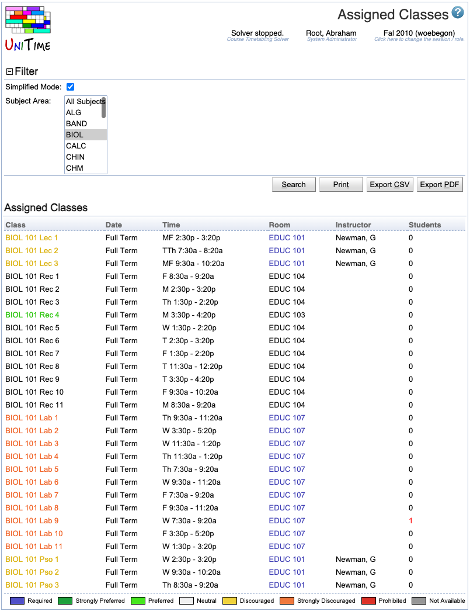

## Screen Description

 The Assigned Classes screen provides a view of time/room assignments for classes of a selected or loaded timetable. Note: To see all the classes for a particular subject area, go to the [Classes](classes) or [Class Assignments](class-assignments) screen.

## Filter

* **Simplified mode**
	* Choose how many parameters you want to display for each of the classes
		* If checked, only the number of student conflicts is displayed in the right part of the table 
		* If unchecked, many more columns are displayed - see below (Assigned Classes) for a list of displayed parameters 
	* In most cases, you will want to use the simplified mode

* **Subject Area**
	* Select the subject area for which the assigned classes should be displayed
	* Note: only the classes of the selected/loaded timetable will be displayed - it is possible that there are classes of a given subject area that are timetabled by a different timetabling manager and therefore are a part of a different timetable

* Click **Apply** to apply a change in the filter

## Assigned Classes

 The list of assigned classes contains classes of the selected/loaded timetable together with their time and room assignments. The colors of the time and room assignments reflect the preference put on a given class for that given time or room (for example, a blue time means that the time was a required time for a given class, an orange room means that the room was strongly discouraged for a given class). The legend for this color coding is displayed at the bottom of the list.

 The color on the class name indicates how easily is the class to move.

* a class that can be moved to some other room without any conflict is marked as strongly preferred

* a class can be moved to some other room (with a conflict) and to some other time (with no conflict) is marked as preferred

* a class that can be moved to some other room (with a conflict) is marked as neutral

* a class that is fixed in room, but can be moved to some other time (without any conflict) is marked as discouraged

* a class that is fixed in room, but can be moved to some other time (with a conflict) is marked as strongly discouraged

* a class that is fixed in time and room is marked as required

 The color coding is very similar but computed slightly differently for a class that is not assigned (based on whether it can be assigned to one or more times and one or more rooms).

 The columns displayed in the table are described in the [Class Assignment Properties](class-assignment-properties) help page. You can sort by any of the columns by clicking on the appropriate column heading.

 Click on any class to get to the [Suggestions](suggestions) screen for that class - you can make changes to the time and/or room assignment in that screen.

## Operations

* **Apply**
	* Apply the changes made to the filter

* **Export PDF**
	* Export the list of assigned classes to a PDF document

* **Refresh**
	* Refresh the list of assigned classes
		* Do this e.g. after you have changed a time/room assignment for a class in the [Suggestions](suggestions) screen - the Assigned Classes screen is not refreshed automatically in such case

{:class='screenshot'}
