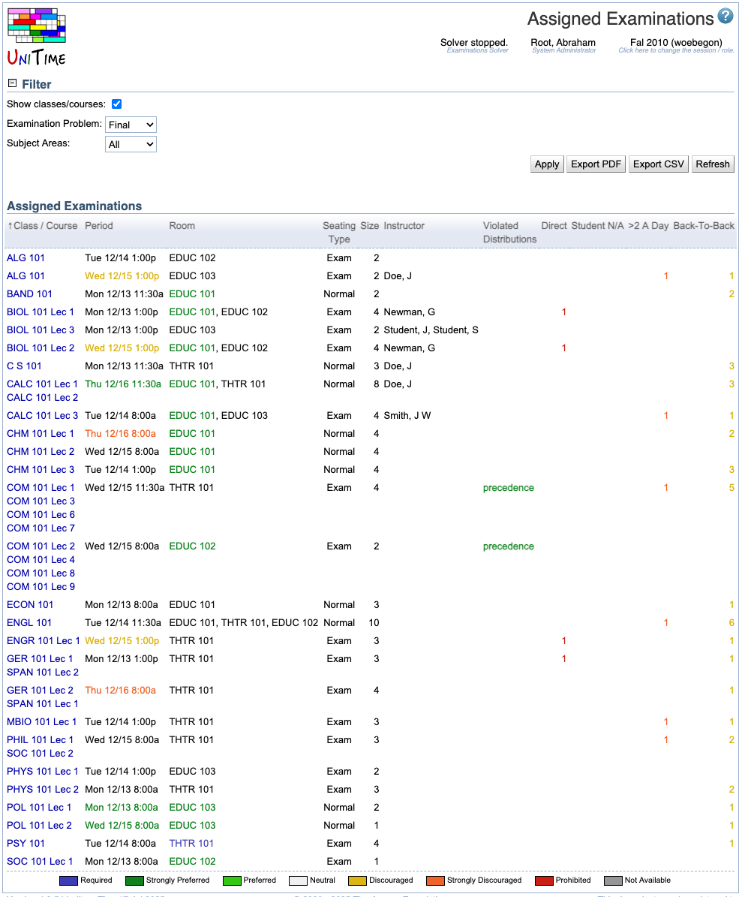

## Screen Description

 The Assigned Examinations screen provides a list of examinations that have been assigned time and room(s).

## Filter

* **Show classes/courses**
	* Show classes/courses instead of examination name
		* When checked, names of all classes/courses that are associated with the exam are listed
		* When unchecked, the examination name is printed

* **Examination Problem**
	* Final or Midterm examinations

* **Subject Areas**
	* Select a subject area for which you want to display the examinations or select "All" to display examinations for all subject areas

## Assigned Examinations

 A list of examinations with assigned periods and rooms

* **Classes/Courses**
	* Classes/Courses whose students should take this examination
	* Displayed if the "Show classes/courses" checkbox is checked in the Filter part

* **Examination**
	* Name of the examination
	* Displayed if the "Show classes/courses" checkbox is unchecked in the Filter part

* **Period**
	* Period assigned to this examination

* **Room**
	* Room(s) assigned to the examination

* **Seating Type**
	* Normal or Exam (this influences the number of seats available)

* **Size**
	* Examination size (number of seats needed in the room or rooms)

* **Instructor**
	* Instructor for the examination

* **Violated Distributions**
	* Examination Distribution Preferences violated by the current period/room assignment

* **Direct**
	* Number of students who have another examination overlapping with this one

* **Student N/A**
	* Number of students that are not available during the time of this exam (because they are enrolled into a class or some other course event)

* **>2 A Day**
	* Number of students from this examination who have at least one other examination on the same day

* **Back-To-Back**
	* Number of students who should take this examination who have another examination back to back with this one

## Operations

* **Apply**
	* Apply changes made in the Filter section

* **Export PDF**
	* Export the list of assigned examinations into a PDF file

* **Refresh**
	* Refresh the list of assigned examinations

{:class='screenshot'}
