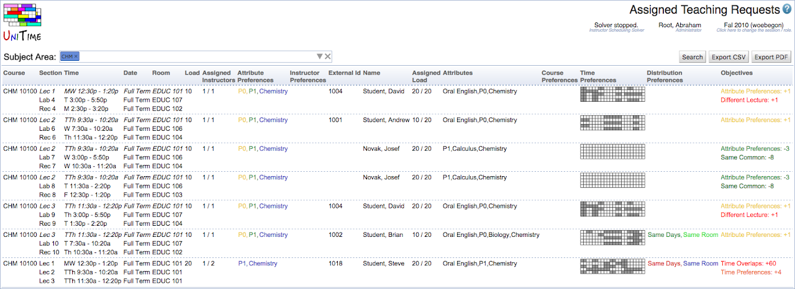
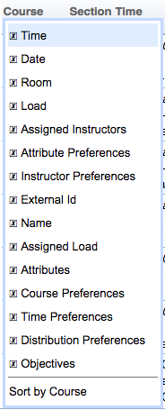

## Screen Description

 The list of assigned teaching requests can be seen on the Assigned Teaching Requests page. The page can either show the data as they are assigned in the solver (showing the current solution, when the solver is loaded in memory) or the teaching assignments as they are saved in the database.

## Details

 The page consists of a filter that allows to search for teaching requests by their subject area, individual attributes (that are requested or that the assigned instructors have), by a particular course or instructor.

 The table shows a list of assigned teaching requests meeting the above filter. Each teaching request contains the course, the list of classes it applies to (classes that are not to be assigned to the instructor are in italics -- e.g., the lecture) with their date, time, and room assignments. Next, there is the requested load, the number of assigned/requested instructors, and the requested attribute and instructor preferences. The Assigned Teaching Requests page also contains information about the assigned instructor. That is, the instructor’s external id, name, teaching preference (shown as the color of the instructor’s external id and name), assigned / maximal teaching load, instructor attributes, course, time and distribution preferences. The time preferences grid also contains times when the instructor is not available because he is enrolled in a class as a student, or he/she is assigned to a class as an instructor outside of the instructor scheduling problem (gray color). The last column contains individual penalization of various criteria for the assignment.

## Operations

 The table page can be sorted by any column and particular columns can be shown/hidden using the context menu on the table header. The content of the table can be exported in CSV (comma separated value) or PDF format using the Export CSV or Export PDF buttons respectively. The exported file contains the same columns as they are currently visible on the page and the requests are ordered in the same manner as well.

{:class='screenshot'}

{:class='screenshot'}

 More details are shown when a particular teaching request is clicked, see [Teaching Request Detail](teaching-request-detail).
